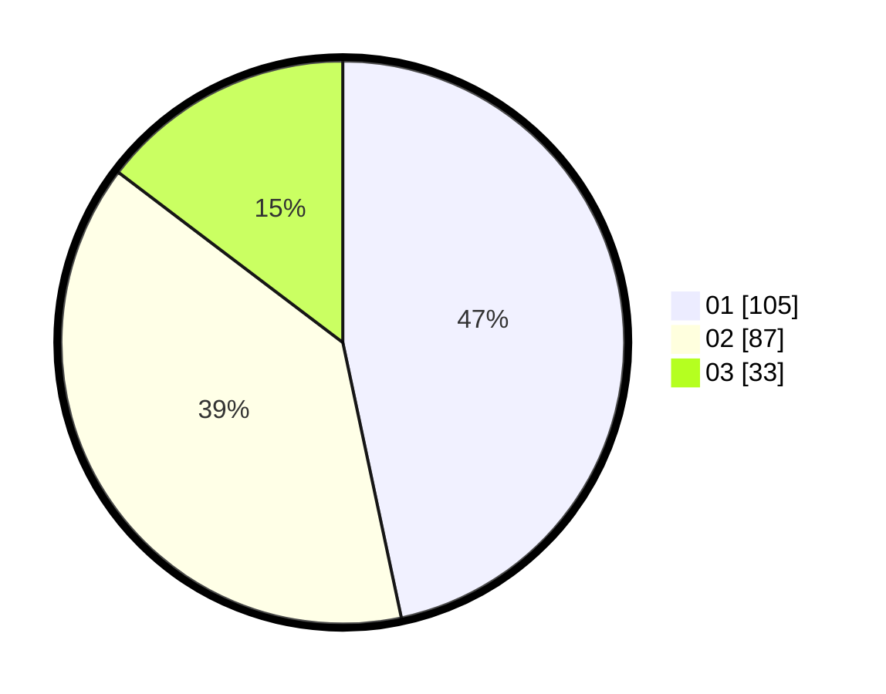

# Hasil

Hasil perolehan suara paslon dapat dilihat pada file paslon-01.txt, paslon-02.txt, dan paslon-03.txt.

Jika tidak ada, artinya data tersebut belum ada pada SIREKAP.

## Perolehan Suara

 * Paslon 01: **105**.
 * Paslon 02: **87**.
 * Paslon 03: **33**.

## Foto C Plano

https://sirekap-obj-formc.kpu.go.id/bf8f/pemilu/ppwp/31/75/02/10/03/3175021003060-20240214-203922--a33f61b0-b34c-443e-aa2b-29aaf1f28fc6.jpg

https://sirekap-obj-formc.kpu.go.id/bf8f/pemilu/ppwp/31/75/02/10/03/3175021003060-20240215-000628--a4099d54-a8a2-4fc1-97bd-d997b7d1eb63.jpg

https://sirekap-obj-formc.kpu.go.id/bf8f/pemilu/ppwp/31/75/02/10/03/3175021003060-20240214-204354--ea450bee-33f5-45a7-8add-d3f9f9fb32dc.jpg
