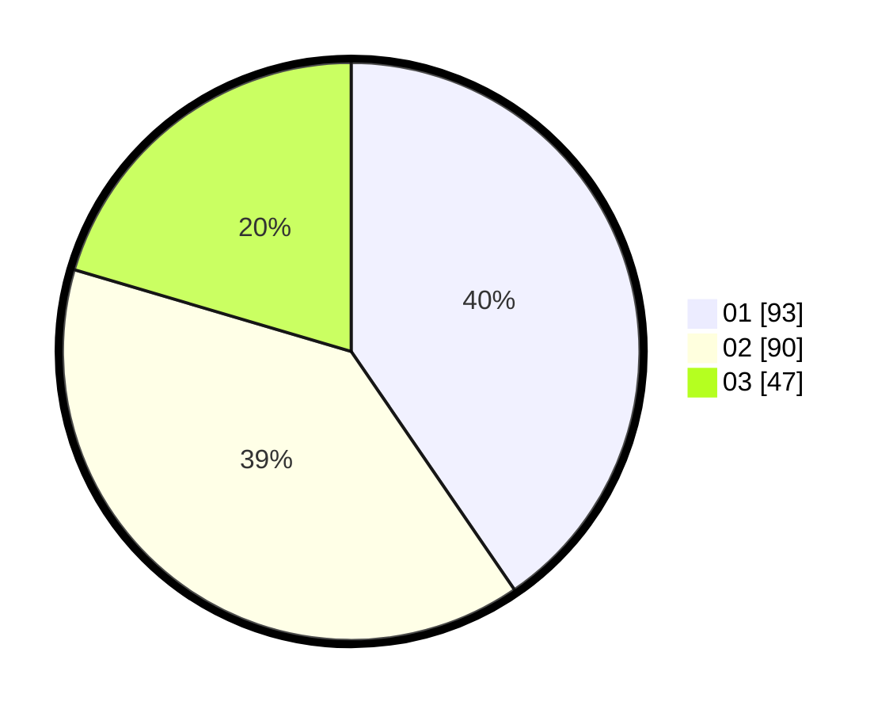

# Hasil

Hasil perolehan suara paslon dapat dilihat pada file paslon-01.txt, paslon-02.txt, dan paslon-03.txt.

Jika tidak ada, artinya data tersebut belum ada pada SIREKAP.

## Perolehan Suara

 * Paslon 01: **93**.
 * Paslon 02: **90**.
 * Paslon 03: **47**.

## Foto C Plano

https://sirekap-obj-formc.kpu.go.id/7423/pemilu/ppwp/31/75/02/10/03/3175021003062-20240214-193844--c5104eab-0762-472f-b06f-c90afd8a6229.jpg

https://sirekap-obj-formc.kpu.go.id/7423/pemilu/ppwp/31/75/02/10/03/3175021003062-20240214-155134--c97efc67-7a57-4a33-bfa5-aa496c38bde9.jpg

https://sirekap-obj-formc.kpu.go.id/7423/pemilu/ppwp/31/75/02/10/03/3175021003062-20240214-155207--8a94f3b1-2b48-47ac-b5f6-3c7f36694565.jpg

## DATA PEMILIH TETAP

Jumlah pemilih dalam DPT: **226**.
 * L: **100**.
 * P: **126**.

## DATA PENGGUNA HAK PILIH

Jumlah pengguna hak pilih dalam DPT: **226**.
 * L: **100**.
 * P: **126**.

Jumlah pengguna hak pilih dalam DPTb: **3**.
 * L: **3**.
 * P: **0**.

Jumlah pengguna hak pilih dalam DPK: **4**.
 * L: **0**.
 * P: **4**.

Jumlah pengguna hak pilih: **233**.
 * L: **103**.
 * P: **130**.

## JUMLAH SUARA SAH DAN TIDAK SAH

JUMLAH SELURUH SUARA SAH: **230**.

JUMLAH SUARA TIDAK SAH: **3**.

JUMLAH SELURUH SUARA SAH DAN SUARA TIDAK SAH: **233**.
