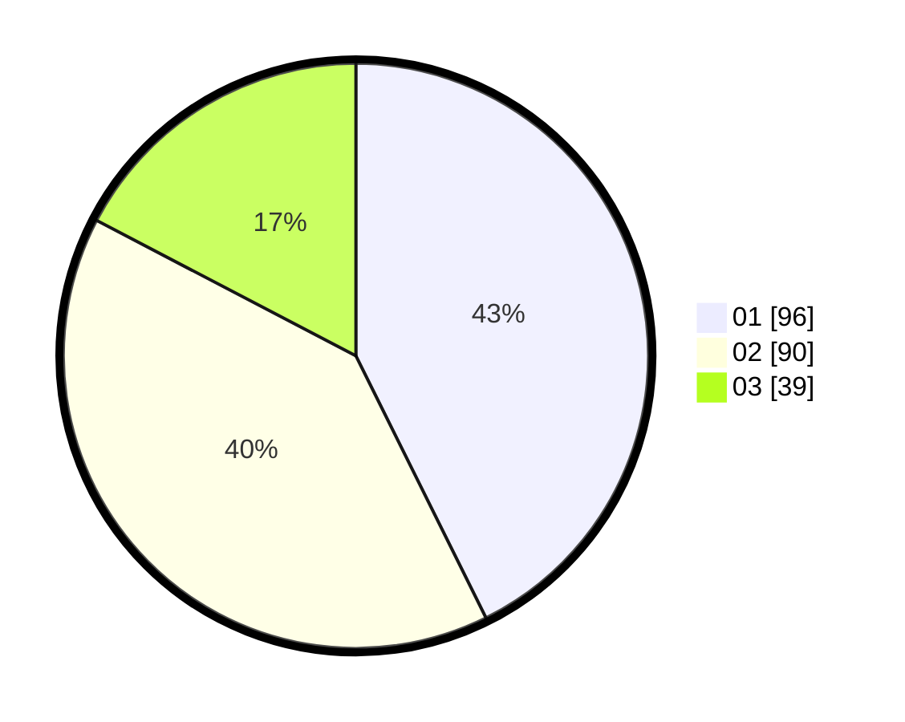

# Hasil

Hasil perolehan suara paslon dapat dilihat pada file paslon-01.txt, paslon-02.txt, dan paslon-03.txt.

Jika tidak ada, artinya data tersebut belum ada pada SIREKAP.

## Perolehan Suara

 * Paslon 01: **96**.
 * Paslon 02: **90**.
 * Paslon 03: **39**.

## Foto C Plano

https://sirekap-obj-formc.kpu.go.id/749d/pemilu/ppwp/31/75/02/10/03/3175021003064-20240216-092124--0835fa34-90a8-46e6-9c2e-8dfa5e9a4a91.jpg

https://sirekap-obj-formc.kpu.go.id/749d/pemilu/ppwp/31/75/02/10/03/3175021003064-20240216-092125--00d97b9b-2e4f-4af7-99bd-af5cbb83bc53.jpg

https://sirekap-obj-formc.kpu.go.id/749d/pemilu/ppwp/31/75/02/10/03/3175021003064-20240216-092125--01a5de8f-2e91-4ea5-9e27-cc3b646df341.jpg

## DATA PEMILIH TETAP

Jumlah pemilih dalam DPT: **287**.
 * L: **143**.
 * P: **144**.

## DATA PENGGUNA HAK PILIH

Jumlah pengguna hak pilih dalam DPT: **219**.
 * L: **108**.
 * P: **111**.

Jumlah pengguna hak pilih dalam DPTb: **1**.
 * L: **0**.
 * P: **1**.

Jumlah pengguna hak pilih dalam DPK: **7**.
 * L: **7**.
 * P: **0**.

Jumlah pengguna hak pilih: **227**.
 * L: **115**.
 * P: **112**.

## JUMLAH SUARA SAH DAN TIDAK SAH

JUMLAH SELURUH SUARA SAH: **226**.

JUMLAH SUARA TIDAK SAH: **1**.

JUMLAH SELURUH SUARA SAH DAN SUARA TIDAK SAH: **227**.
