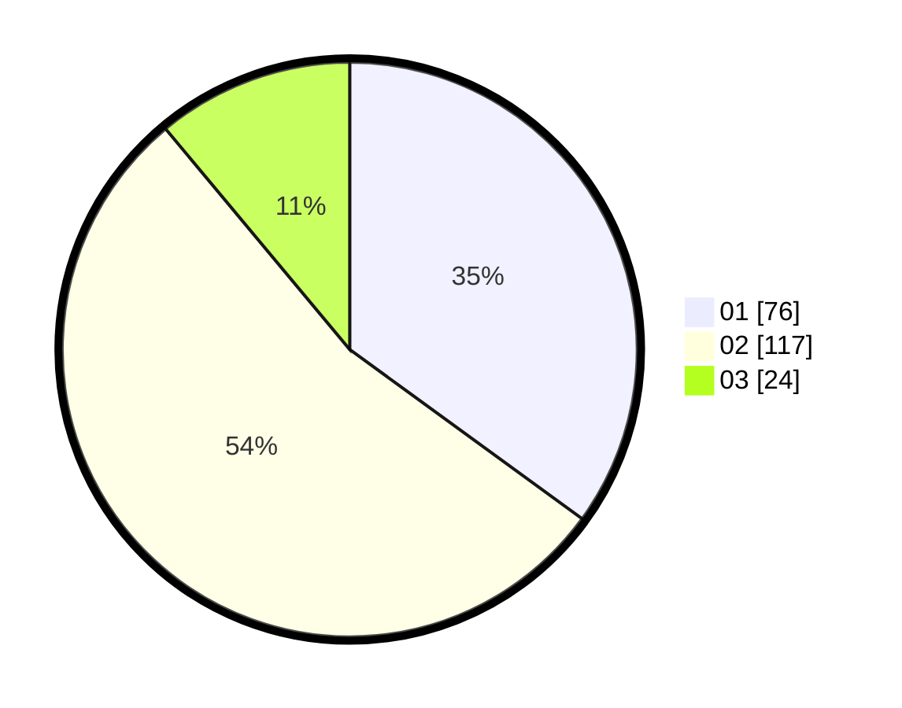

# Hasil

Hasil perolehan suara paslon dapat dilihat pada file paslon-01.txt, paslon-02.txt, dan paslon-03.txt.

Jika tidak ada, artinya data tersebut belum ada pada SIREKAP.

## Perolehan Suara

 * Paslon 01: **76**.
 * Paslon 02: **117**.
 * Paslon 03: **24**.

## Foto C Plano

https://sirekap-obj-formc.kpu.go.id/2c2a/pemilu/ppwp/31/75/02/10/03/3175021003065-20240214-194910--b03510dd-3ee3-42fa-b7ff-b33e639dad8f.jpg

https://sirekap-obj-formc.kpu.go.id/2c2a/pemilu/ppwp/31/75/02/10/03/3175021003065-20240214-155653--8d70e818-7707-48b8-b3b6-b3cd3c728ff5.jpg

https://sirekap-obj-formc.kpu.go.id/2c2a/pemilu/ppwp/31/75/02/10/03/3175021003065-20240214-194922--c5350620-f7c2-468c-9a61-7a7985f91827.jpg

## DATA PEMILIH TETAP

Jumlah pemilih dalam DPT: **283**.
 * L: **134**.
 * P: **149**.

## DATA PENGGUNA HAK PILIH

Jumlah pengguna hak pilih dalam DPT: **214**.
 * L: **102**.
 * P: **112**.

Jumlah pengguna hak pilih dalam DPTb: **7**.
 * L: **1**.
 * P: **6**.

Jumlah pengguna hak pilih dalam DPK: **0**.
 * L: **0**.
 * P: **0**.

Jumlah pengguna hak pilih: **221**.
 * L: **103**.
 * P: **118**.

## JUMLAH SUARA SAH DAN TIDAK SAH

JUMLAH SELURUH SUARA SAH: **217**.

JUMLAH SUARA TIDAK SAH: **4**.

JUMLAH SELURUH SUARA SAH DAN SUARA TIDAK SAH: **221**.
