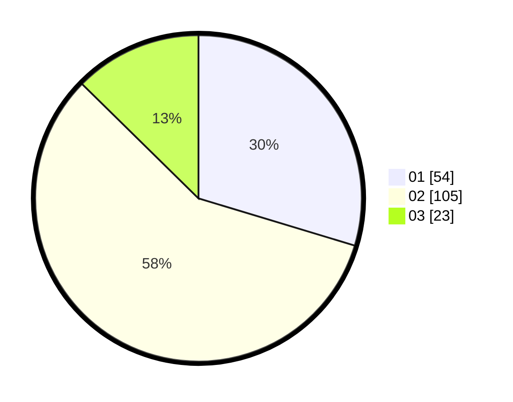

# Hasil

Hasil perolehan suara paslon dapat dilihat pada file paslon-01.txt, paslon-02.txt, dan paslon-03.txt.

Jika tidak ada, artinya data tersebut belum ada pada SIREKAP.

## Perolehan Suara

 * Paslon 01: **54**.
 * Paslon 02: **105**.
 * Paslon 03: **23**.

## Foto C Plano

https://sirekap-obj-formc.kpu.go.id/3065/pemilu/ppwp/31/75/02/10/03/3175021003068-20240214-230344--9a5a4249-38c4-48fb-b4e1-7b6d5b80d2d7.jpg

https://sirekap-obj-formc.kpu.go.id/3065/pemilu/ppwp/31/75/02/10/03/3175021003068-20240214-230518--f5ab153b-80e7-436d-b027-081bf0ed346e.jpg

https://sirekap-obj-formc.kpu.go.id/3065/pemilu/ppwp/31/75/02/10/03/3175021003068-20240214-230801--fb154067-6938-43de-80a6-bf26d68e4342.jpg
