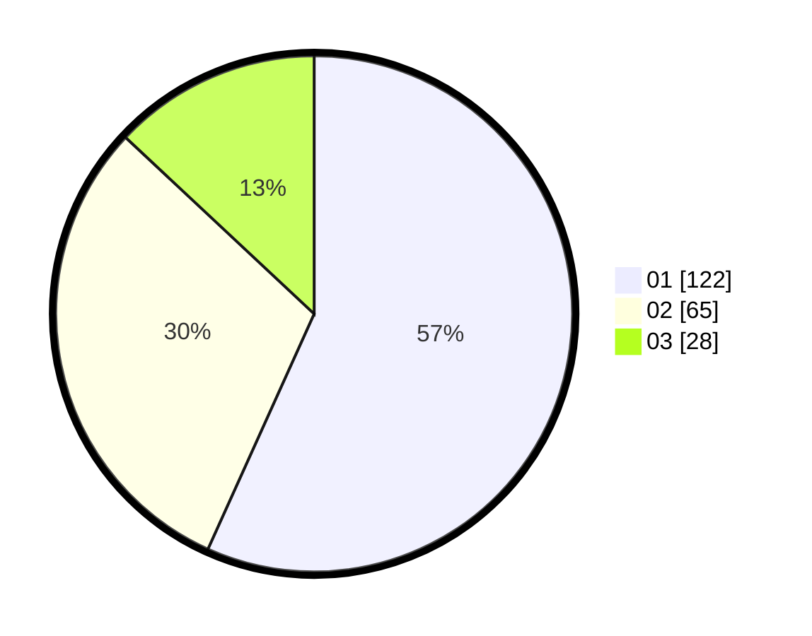

# Hasil

Hasil perolehan suara paslon dapat dilihat pada file paslon-01.txt, paslon-02.txt, dan paslon-03.txt.

Jika tidak ada, artinya data tersebut belum ada pada SIREKAP.

## Perolehan Suara

 * Paslon 01: **122**.
 * Paslon 02: **65**.
 * Paslon 03: **28**.

## Foto C Plano

https://sirekap-obj-formc.kpu.go.id/51b3/pemilu/ppwp/31/75/02/10/03/3175021003085-20240215-032746--9ff9a2b9-1251-475a-ac86-7be30d305399.jpg

https://sirekap-obj-formc.kpu.go.id/51b3/pemilu/ppwp/31/75/02/10/03/3175021003085-20240215-032940--e0877cb6-f1bd-4c36-a6a1-b5efaf9f38c7.jpg

https://sirekap-obj-formc.kpu.go.id/51b3/pemilu/ppwp/31/75/02/10/03/3175021003085-20240215-033108--a2f918fe-998b-4e39-862a-bcd8b600f50e.jpg
