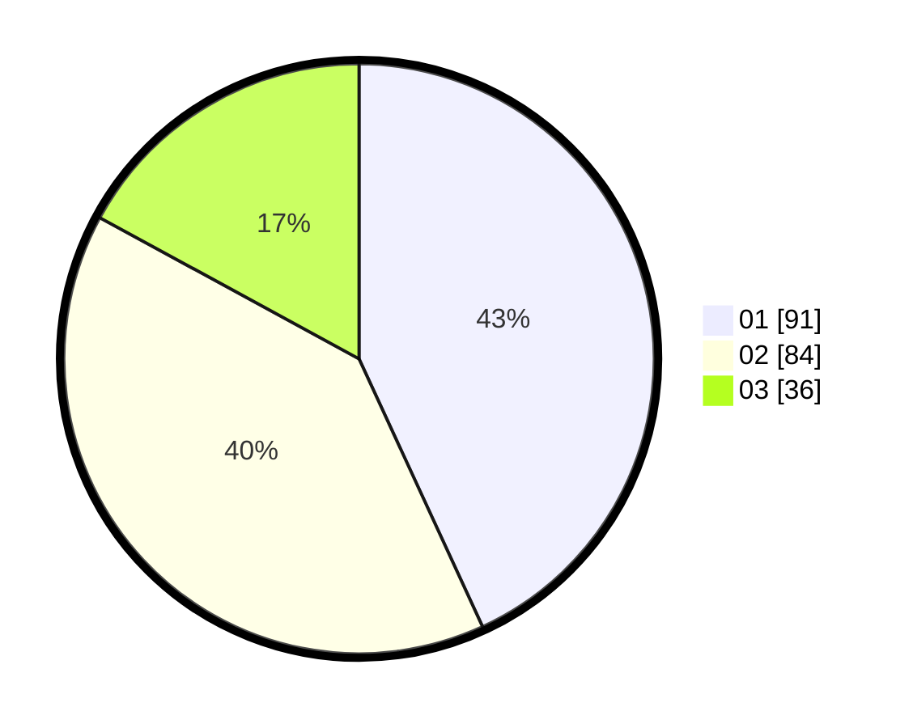

# Hasil

Hasil perolehan suara paslon dapat dilihat pada file paslon-01.txt, paslon-02.txt, dan paslon-03.txt.

Jika tidak ada, artinya data tersebut belum ada pada SIREKAP.

## Perolehan Suara

 * Paslon 01: **91**.
 * Paslon 02: **84**.
 * Paslon 03: **36**.

## Foto C Plano

https://sirekap-obj-formc.kpu.go.id/f84a/pemilu/ppwp/31/75/02/10/03/3175021003091-20240214-194310--467774c0-1a73-498a-9fec-8620c19070e1.jpg

https://sirekap-obj-formc.kpu.go.id/f84a/pemilu/ppwp/31/75/02/10/03/3175021003091-20240214-192313--fb2cbe97-ff4f-4ba7-8a00-222d62874205.jpg

https://sirekap-obj-formc.kpu.go.id/f84a/pemilu/ppwp/31/75/02/10/03/3175021003091-20240214-192340--6669efb7-4f94-487e-92e6-098a1f0e8b51.jpg
