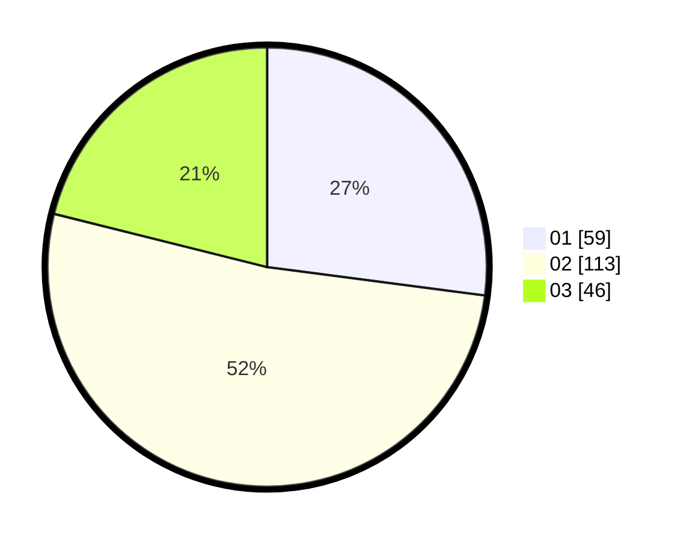

# Hasil

Hasil perolehan suara paslon dapat dilihat pada file paslon-01.txt, paslon-02.txt, dan paslon-03.txt.

Jika tidak ada, artinya data tersebut belum ada pada SIREKAP.

## Perolehan Suara

 * Paslon 01: **59**.
 * Paslon 02: **113**.
 * Paslon 03: **46**.

## Foto C Plano

https://sirekap-obj-formc.kpu.go.id/852a/pemilu/ppwp/31/75/02/10/03/3175021003095-20240215-031840--bb0c52e5-e208-4bfe-9dc5-3e5ebc6319bc.jpg

https://sirekap-obj-formc.kpu.go.id/852a/pemilu/ppwp/31/75/02/10/03/3175021003095-20240215-031948--2a49fab2-ff93-4888-9908-59c1c5a4313a.jpg

https://sirekap-obj-formc.kpu.go.id/852a/pemilu/ppwp/31/75/02/10/03/3175021003095-20240215-032059--62150694-3cff-4d06-b216-0e12ddc4d049.jpg
