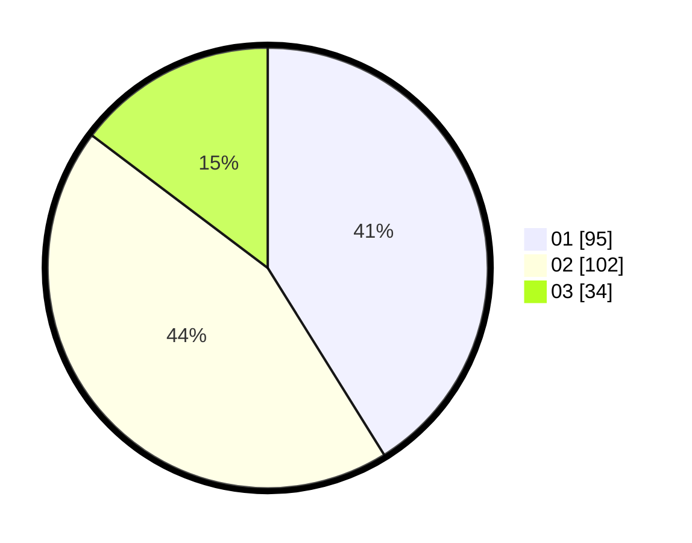

# Hasil

Hasil perolehan suara paslon dapat dilihat pada file paslon-01.txt, paslon-02.txt, dan paslon-03.txt.

Jika tidak ada, artinya data tersebut belum ada pada SIREKAP.

## Perolehan Suara

 * Paslon 01: **95**.
 * Paslon 02: **102**.
 * Paslon 03: **34**.

## Foto C Plano

https://sirekap-obj-formc.kpu.go.id/0fca/pemilu/ppwp/31/75/02/10/03/3175021003099-20240215-013049--176ea150-000a-4d4c-babc-a6d5c8b8f00d.jpg

https://sirekap-obj-formc.kpu.go.id/0fca/pemilu/ppwp/31/75/02/10/03/3175021003099-20240215-013221--44abb001-5c26-4cbd-8c28-8e0e7daaf931.jpg

https://sirekap-obj-formc.kpu.go.id/0fca/pemilu/ppwp/31/75/02/10/03/3175021003099-20240215-013302--b99c5045-1072-41c2-91be-e45f75874903.jpg
