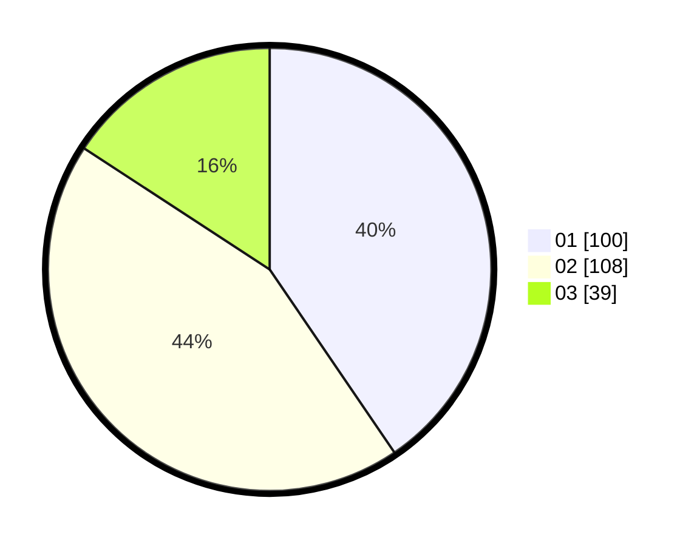

# Hasil

Hasil perolehan suara paslon dapat dilihat pada file paslon-01.txt, paslon-02.txt, dan paslon-03.txt.

Jika tidak ada, artinya data tersebut belum ada pada SIREKAP.

## Perolehan Suara

 * Paslon 01: **100**.
 * Paslon 02: **108**.
 * Paslon 03: **39**.

## Foto C Plano

https://sirekap-obj-formc.kpu.go.id/4e41/pemilu/ppwp/31/75/02/10/03/3175021003101-20240214-202903--17181bbb-864e-45a5-aeaa-a75f7624c57c.jpg

https://sirekap-obj-formc.kpu.go.id/4e41/pemilu/ppwp/31/75/02/10/03/3175021003101-20240214-213539--13633bec-9fe7-4ad1-b3bc-7cb34da7948f.jpg

https://sirekap-obj-formc.kpu.go.id/4e41/pemilu/ppwp/31/75/02/10/03/3175021003101-20240214-203106--04844edd-8073-4be3-9791-ec8bc65ee158.jpg

## DATA PEMILIH TETAP

Jumlah pemilih dalam DPT: **292**.
 * L: **146**.
 * P: **146**.

## DATA PENGGUNA HAK PILIH

Jumlah pengguna hak pilih dalam DPT: **244**.
 * L: **122**.
 * P: **122**.

Jumlah pengguna hak pilih dalam DPTb: **0**.
 * L: **0**.
 * P: **0**.

Jumlah pengguna hak pilih dalam DPK: **7**.
 * L: **2**.
 * P: **5**.

Jumlah pengguna hak pilih: **251**.
 * L: **142**.
 * P: **127**.

## JUMLAH SUARA SAH DAN TIDAK SAH

JUMLAH SELURUH SUARA SAH: **247**.

JUMLAH SUARA TIDAK SAH: **4**.

JUMLAH SELURUH SUARA SAH DAN SUARA TIDAK SAH: **251**.
