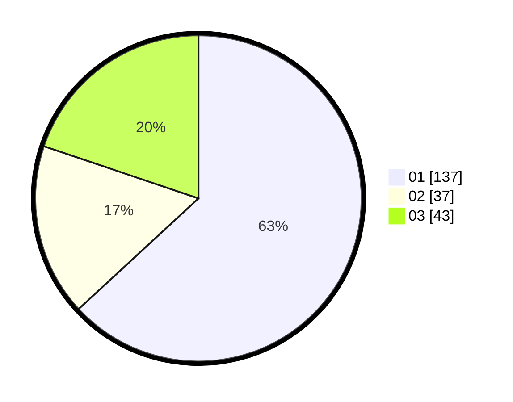

# Hasil

Hasil perolehan suara paslon dapat dilihat pada file paslon-01.txt, paslon-02.txt, dan paslon-03.txt.

Jika tidak ada, artinya data tersebut belum ada pada SIREKAP.

## Perolehan Suara

 * Paslon 01: **137**.
 * Paslon 02: **37**.
 * Paslon 03: **43**.

## Foto C Plano

https://sirekap-obj-formc.kpu.go.id/b17d/pemilu/ppwp/31/75/02/10/03/3175021003109-20240217-214140--47b50fcc-a694-4c3d-8b6e-7a4838fc310a.jpg

https://sirekap-obj-formc.kpu.go.id/b17d/pemilu/ppwp/31/75/02/10/03/3175021003109-20240217-214142--9feb4892-7550-4902-b4cd-8680cb606669.jpg

https://sirekap-obj-formc.kpu.go.id/b17d/pemilu/ppwp/31/75/02/10/03/3175021003109-20240217-214141--0ec92fd9-9f18-4876-8bfe-6da5134fb835.jpg

## DATA PEMILIH TETAP

Jumlah pemilih dalam DPT: **275**.
 * L: **135**.
 * P: **140**.

## DATA PENGGUNA HAK PILIH

Jumlah pengguna hak pilih dalam DPT: **216**.
 * L: **98**.
 * P: **118**.

Jumlah pengguna hak pilih dalam DPTb: **1**.
 * L: **0**.
 * P: **1**.

Jumlah pengguna hak pilih dalam DPK: **5**.
 * L: **3**.
 * P: **2**.

Jumlah pengguna hak pilih: **222**.
 * L: **101**.
 * P: **121**.

## JUMLAH SUARA SAH DAN TIDAK SAH

JUMLAH SELURUH SUARA SAH: **217**.

JUMLAH SUARA TIDAK SAH: **5**.

JUMLAH SELURUH SUARA SAH DAN SUARA TIDAK SAH: **222**.
