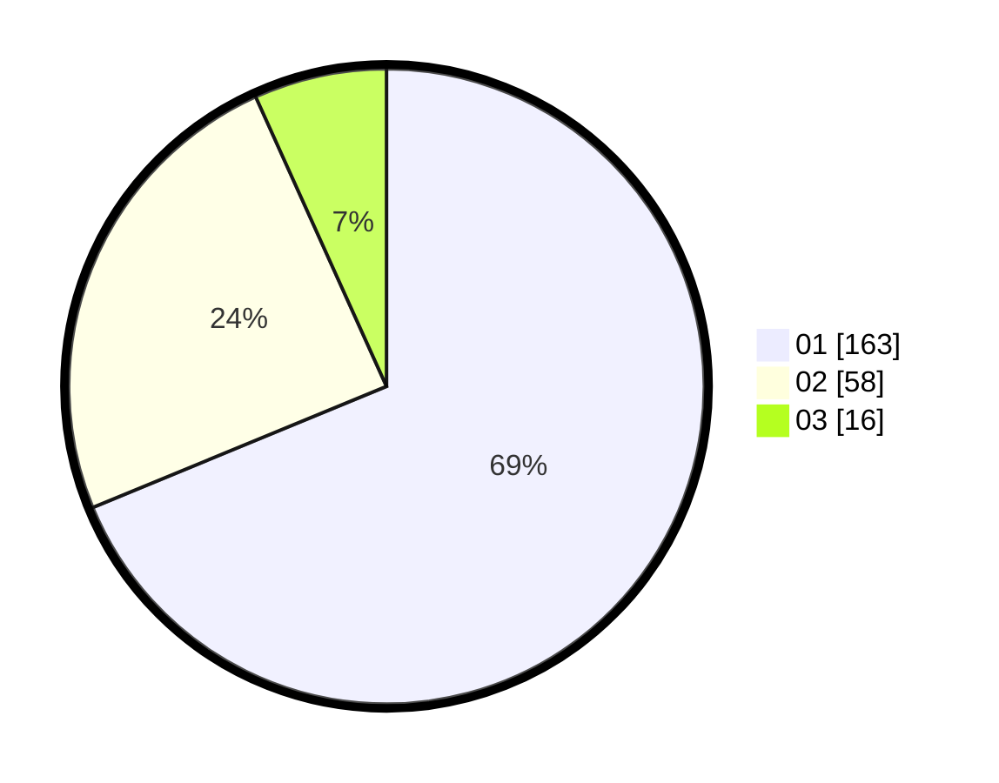

# Hasil

Hasil perolehan suara paslon dapat dilihat pada file paslon-01.txt, paslon-02.txt, dan paslon-03.txt.

Jika tidak ada, artinya data tersebut belum ada pada SIREKAP.

## Perolehan Suara

 * Paslon 01: **163**.
 * Paslon 02: **58**.
 * Paslon 03: **16**.

## Foto C Plano

https://sirekap-obj-formc.kpu.go.id/8654/pemilu/ppwp/31/75/02/10/03/3175021003112-20240215-030058--664658cd-f276-4d71-bf5a-dc047ce91741.jpg

https://sirekap-obj-formc.kpu.go.id/8654/pemilu/ppwp/31/75/02/10/03/3175021003112-20240215-020506--47dcdad4-f207-42b7-8f55-f07355de6f79.jpg

https://sirekap-obj-formc.kpu.go.id/8654/pemilu/ppwp/31/75/02/10/03/3175021003112-20240215-021029--81cc7eb2-de82-4301-b578-f7f336cb163b.jpg
