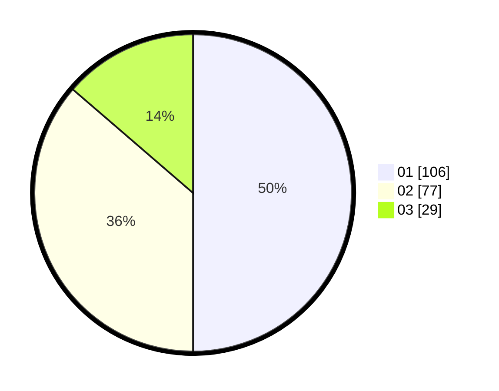

# Hasil

Hasil perolehan suara paslon dapat dilihat pada file paslon-01.txt, paslon-02.txt, dan paslon-03.txt.

Jika tidak ada, artinya data tersebut belum ada pada SIREKAP.

## Perolehan Suara

 * Paslon 01: **106**.
 * Paslon 02: **77**.
 * Paslon 03: **29**.

## Foto C Plano

https://sirekap-obj-formc.kpu.go.id/2ca3/pemilu/ppwp/31/75/02/10/03/3175021003114-20240214-233609--453df5a4-cce7-4e03-b5a7-cb0481cf77d1.jpg

https://sirekap-obj-formc.kpu.go.id/2ca3/pemilu/ppwp/31/75/02/10/03/3175021003114-20240214-233656--03a6338d-c33b-4847-9927-445b7d524db5.jpg

https://sirekap-obj-formc.kpu.go.id/2ca3/pemilu/ppwp/31/75/02/10/03/3175021003114-20240214-233724--85a6d58b-a4d7-4778-bc48-66b56f234ca2.jpg

## DATA PEMILIH TETAP

Jumlah pemilih dalam DPT: **272**.
 * L: **143**.
 * P: **129**.

## DATA PENGGUNA HAK PILIH

Jumlah pengguna hak pilih dalam DPT: **214**.
 * L: **107**.
 * P: **107**.

Jumlah pengguna hak pilih dalam DPTb: **2**.
 * L: **0**.
 * P: **2**.

Jumlah pengguna hak pilih dalam DPK: **1**.
 * L: **1**.
 * P: **0**.

Jumlah pengguna hak pilih: **217**.
 * L: **108**.
 * P: **109**.

## JUMLAH SUARA SAH DAN TIDAK SAH

JUMLAH SELURUH SUARA SAH: **212**.

JUMLAH SUARA TIDAK SAH: **5**.

JUMLAH SELURUH SUARA SAH DAN SUARA TIDAK SAH: **217**.
