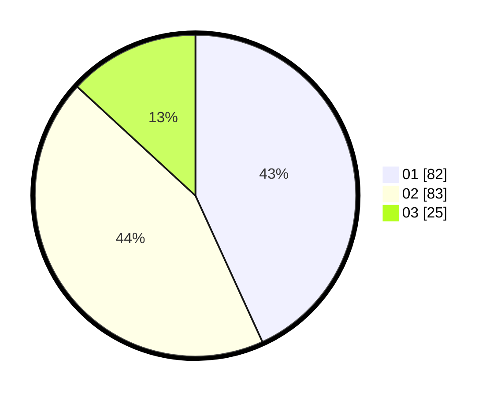

# Hasil

Hasil perolehan suara paslon dapat dilihat pada file paslon-01.txt, paslon-02.txt, dan paslon-03.txt.

Jika tidak ada, artinya data tersebut belum ada pada SIREKAP.

## Perolehan Suara

 * Paslon 01: **82**.
 * Paslon 02: **83**.
 * Paslon 03: **25**.

## Foto C Plano

https://sirekap-obj-formc.kpu.go.id/6b76/pemilu/ppwp/31/75/02/10/03/3175021003115-20240214-190733--c2418d29-8eba-4929-b6e1-228239e2a048.jpg

https://sirekap-obj-formc.kpu.go.id/6b76/pemilu/ppwp/31/75/02/10/03/3175021003115-20240214-190631--72da4822-9d14-4e0e-8455-ebd5e74e7d9d.jpg

https://sirekap-obj-formc.kpu.go.id/6b76/pemilu/ppwp/31/75/02/10/03/3175021003115-20240214-190830--680cc201-52fa-4016-a33f-d1a9f34d7be2.jpg

## DATA PEMILIH TETAP

Jumlah pemilih dalam DPT: **269**.
 * L: **137**.
 * P: **132**.

## DATA PENGGUNA HAK PILIH

Jumlah pengguna hak pilih dalam DPT: **191**.
 * L: **92**.
 * P: **99**.

Jumlah pengguna hak pilih dalam DPTb: **0**.
 * L: **0**.
 * P: **0**.

Jumlah pengguna hak pilih dalam DPK: **0**.
 * L: **0**.
 * P: **0**.

Jumlah pengguna hak pilih: **191**.
 * L: **92**.
 * P: **99**.

## JUMLAH SUARA SAH DAN TIDAK SAH

JUMLAH SELURUH SUARA SAH: **190**.

JUMLAH SUARA TIDAK SAH: **1**.

JUMLAH SELURUH SUARA SAH DAN SUARA TIDAK SAH: **191**.
