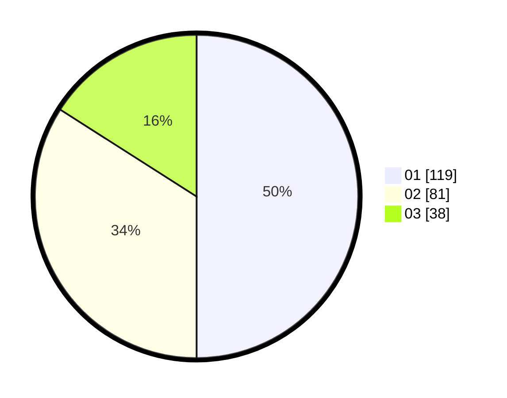

# Hasil

Hasil perolehan suara paslon dapat dilihat pada file paslon-01.txt, paslon-02.txt, dan paslon-03.txt.

Jika tidak ada, artinya data tersebut belum ada pada SIREKAP.

## Perolehan Suara

 * Paslon 01: **119**.
 * Paslon 02: **81**.
 * Paslon 03: **38**.

## Foto C Plano

https://sirekap-obj-formc.kpu.go.id/4869/pemilu/ppwp/31/75/02/10/03/3175021003120-20240214-190753--123018ac-78ac-44de-ae58-948a9f10654b.jpg

https://sirekap-obj-formc.kpu.go.id/4869/pemilu/ppwp/31/75/02/10/03/3175021003120-20240214-204856--3ef9341c-c49b-4220-8766-98f58ed2150a.jpg

https://sirekap-obj-formc.kpu.go.id/4869/pemilu/ppwp/31/75/02/10/03/3175021003120-20240214-194110--65888cc4-ec62-4eec-b5ef-72a35cbe2430.jpg

## DATA PEMILIH TETAP

Jumlah pemilih dalam DPT: **282**.
 * L: **137**.
 * P: **145**.

## DATA PENGGUNA HAK PILIH

Jumlah pengguna hak pilih dalam DPT: **235**.
 * L: **113**.
 * P: **122**.

Jumlah pengguna hak pilih dalam DPTb: **2**.
 * L: **1**.
 * P: **1**.

Jumlah pengguna hak pilih dalam DPK: **2**.
 * L: **0**.
 * P: **2**.

Jumlah pengguna hak pilih: **239**.
 * L: **114**.
 * P: **125**.

## JUMLAH SUARA SAH DAN TIDAK SAH

JUMLAH SELURUH SUARA SAH: **238**.

JUMLAH SUARA TIDAK SAH: **1**.

JUMLAH SELURUH SUARA SAH DAN SUARA TIDAK SAH: **239**.
