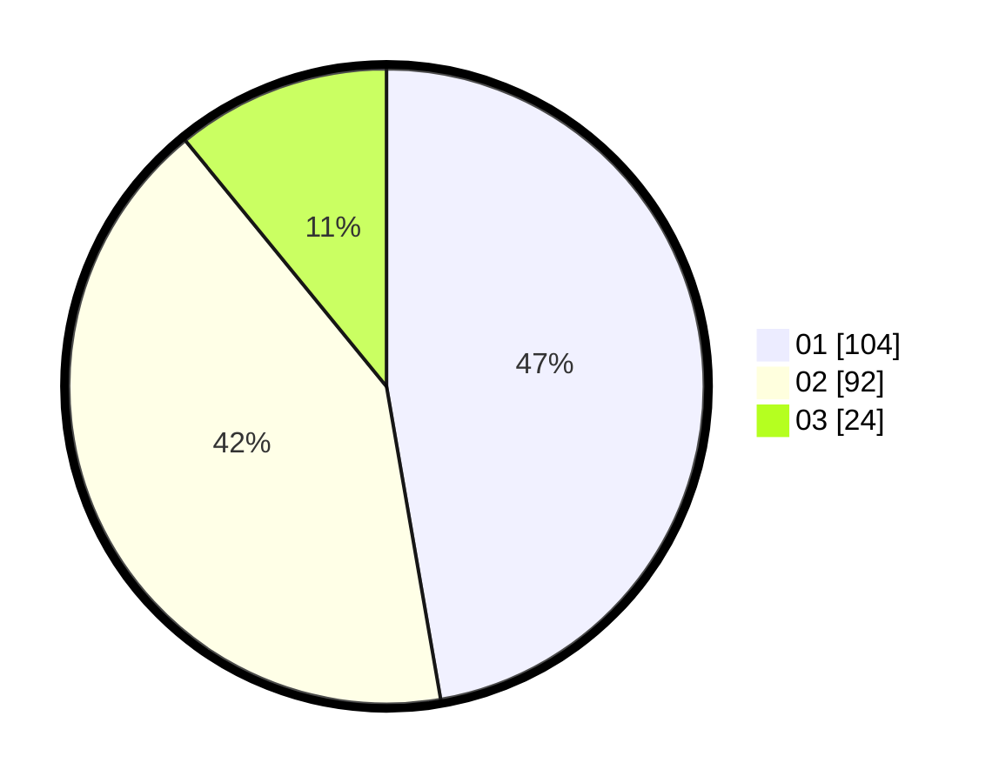

# Hasil

Hasil perolehan suara paslon dapat dilihat pada file paslon-01.txt, paslon-02.txt, dan paslon-03.txt.

Jika tidak ada, artinya data tersebut belum ada pada SIREKAP.

## Perolehan Suara

 * Paslon 01: **104**.
 * Paslon 02: **92**.
 * Paslon 03: **24**.

## Foto C Plano

https://sirekap-obj-formc.kpu.go.id/7169/pemilu/ppwp/31/75/02/10/03/3175021003123-20240214-225057--cdc73ae5-cfae-4efb-a060-e2d15d8ad006.jpg

https://sirekap-obj-formc.kpu.go.id/7169/pemilu/ppwp/31/75/02/10/03/3175021003123-20240214-213025--56e5a3d5-ce9f-4658-b037-3af9c634edc5.jpg

https://sirekap-obj-formc.kpu.go.id/7169/pemilu/ppwp/31/75/02/10/03/3175021003123-20240214-213511--a9b28ed7-157a-48c8-b2ca-17c162260264.jpg

## DATA PEMILIH TETAP

Jumlah pemilih dalam DPT: **287**.
 * L: **144**.
 * P: **143**.

## DATA PENGGUNA HAK PILIH

Jumlah pengguna hak pilih dalam DPT: **225**.
 * L: **111**.
 * P: **114**.

Jumlah pengguna hak pilih dalam DPTb: **1**.
 * L: **1**.
 * P: **0**.

Jumlah pengguna hak pilih dalam DPK: **1**.
 * L: **1**.
 * P: **0**.

Jumlah pengguna hak pilih: **227**.
 * L: **113**.
 * P: **114**.

## JUMLAH SUARA SAH DAN TIDAK SAH

JUMLAH SELURUH SUARA SAH: **220**.

JUMLAH SUARA TIDAK SAH: **7**.

JUMLAH SELURUH SUARA SAH DAN SUARA TIDAK SAH: **227**.
