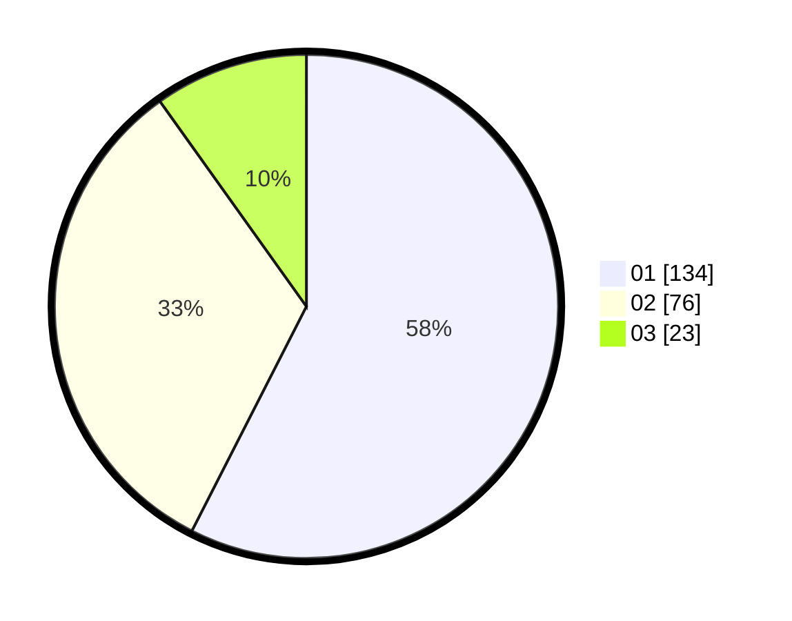

# Hasil

Hasil perolehan suara paslon dapat dilihat pada file paslon-01.txt, paslon-02.txt, dan paslon-03.txt.

Jika tidak ada, artinya data tersebut belum ada pada SIREKAP.

## Perolehan Suara

 * Paslon 01: **134**.
 * Paslon 02: **76**.
 * Paslon 03: **23**.

## Foto C Plano

https://sirekap-obj-formc.kpu.go.id/7c04/pemilu/ppwp/31/75/02/10/03/3175021003124-20240216-054828--5a18cc65-dcc5-483f-8e3a-d7e825613d32.jpg

https://sirekap-obj-formc.kpu.go.id/7c04/pemilu/ppwp/31/75/02/10/03/3175021003124-20240216-054838--7af7d526-ef9b-4f18-aa26-01e1e8442ee9.jpg

https://sirekap-obj-formc.kpu.go.id/7c04/pemilu/ppwp/31/75/02/10/03/3175021003124-20240216-054837--3b4807e5-5384-495a-bac1-2eb46e091144.jpg

## DATA PEMILIH TETAP

Jumlah pemilih dalam DPT: **290**.
 * L: **145**.
 * P: **145**.

## DATA PENGGUNA HAK PILIH

Jumlah pengguna hak pilih dalam DPT: **237**.
 * L: **115**.
 * P: **122**.

Jumlah pengguna hak pilih dalam DPTb: **0**.
 * L: **0**.
 * P: **0**.

Jumlah pengguna hak pilih dalam DPK: **0**.
 * L: **0**.
 * P: **0**.

Jumlah pengguna hak pilih: **237**.
 * L: **115**.
 * P: **122**.

## JUMLAH SUARA SAH DAN TIDAK SAH

JUMLAH SELURUH SUARA SAH: **233**.

JUMLAH SUARA TIDAK SAH: **4**.

JUMLAH SELURUH SUARA SAH DAN SUARA TIDAK SAH: **237**.
