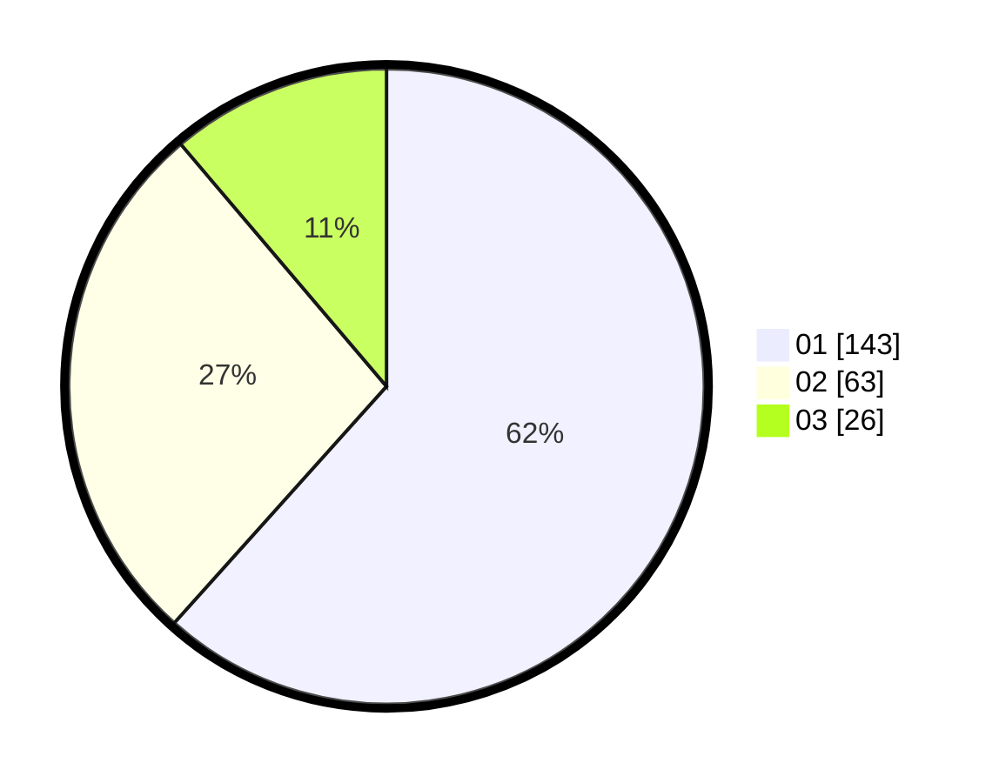

# Hasil

Hasil perolehan suara paslon dapat dilihat pada file paslon-01.txt, paslon-02.txt, dan paslon-03.txt.

Jika tidak ada, artinya data tersebut belum ada pada SIREKAP.

## Perolehan Suara

 * Paslon 01: **143**.
 * Paslon 02: **63**.
 * Paslon 03: **26**.

## Foto C Plano

https://sirekap-obj-formc.kpu.go.id/77ec/pemilu/ppwp/31/75/02/10/03/3175021003126-20240215-004111--6c445ee9-4137-4cbc-9342-d90e3d185d07.jpg

https://sirekap-obj-formc.kpu.go.id/77ec/pemilu/ppwp/31/75/02/10/03/3175021003126-20240215-004232--ad1d0682-6a77-45b4-a22a-0ac5522fc63c.jpg

https://sirekap-obj-formc.kpu.go.id/77ec/pemilu/ppwp/31/75/02/10/03/3175021003126-20240215-004334--656f169e-0844-4cf6-af4c-ad25d56a5dcf.jpg
