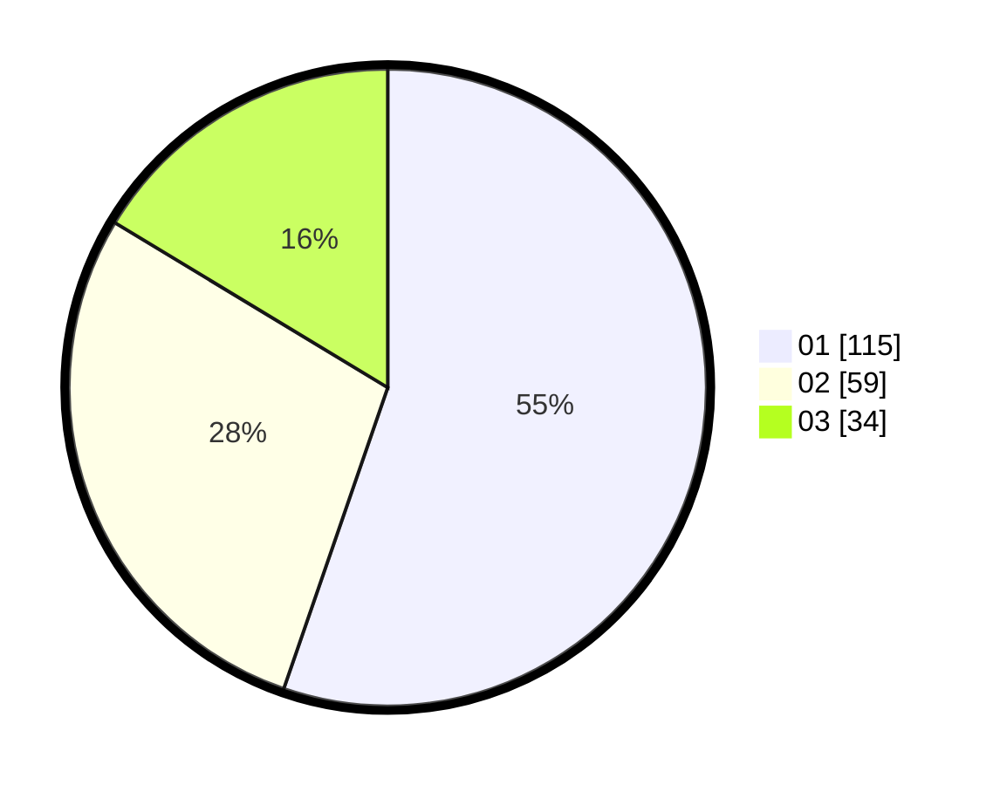

# Hasil

Hasil perolehan suara paslon dapat dilihat pada file paslon-01.txt, paslon-02.txt, dan paslon-03.txt.

Jika tidak ada, artinya data tersebut belum ada pada SIREKAP.

## Perolehan Suara

 * Paslon 01: **115**.
 * Paslon 02: **59**.
 * Paslon 03: **34**.

## Foto C Plano

https://sirekap-obj-formc.kpu.go.id/746e/pemilu/ppwp/31/75/02/10/03/3175021003127-20240214-210121--1059062b-0184-47f2-97cc-45921d2f705d.jpg

https://sirekap-obj-formc.kpu.go.id/746e/pemilu/ppwp/31/75/02/10/03/3175021003127-20240214-230426--315c94ee-64e7-4849-813f-5735b7ad62e8.jpg

https://sirekap-obj-formc.kpu.go.id/746e/pemilu/ppwp/31/75/02/10/03/3175021003127-20240214-210126--de32b665-1da7-43aa-a8c6-b63efc404eb0.jpg

## DATA PEMILIH TETAP

Jumlah pemilih dalam DPT: **281**.
 * L: **129**.
 * P: **152**.

## DATA PENGGUNA HAK PILIH

Jumlah pengguna hak pilih dalam DPT: **214**.
 * L: **95**.
 * P: **119**.

Jumlah pengguna hak pilih dalam DPTb: **1**.
 * L: **0**.
 * P: **1**.

Jumlah pengguna hak pilih dalam DPK: **1**.
 * L: **1**.
 * P: **0**.

Jumlah pengguna hak pilih: **216**.
 * L: **96**.
 * P: **120**.

## JUMLAH SUARA SAH DAN TIDAK SAH

JUMLAH SELURUH SUARA SAH: **208**.

JUMLAH SUARA TIDAK SAH: **8**.

JUMLAH SELURUH SUARA SAH DAN SUARA TIDAK SAH: **216**.
