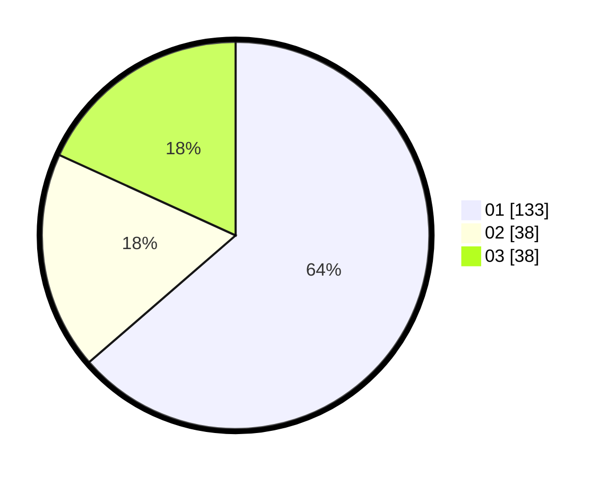

# Hasil

Hasil perolehan suara paslon dapat dilihat pada file paslon-01.txt, paslon-02.txt, dan paslon-03.txt.

Jika tidak ada, artinya data tersebut belum ada pada SIREKAP.

## Perolehan Suara

 * Paslon 01: **133**.
 * Paslon 02: **38**.
 * Paslon 03: **38**.

## Foto C Plano

https://sirekap-obj-formc.kpu.go.id/7cc7/pemilu/ppwp/31/75/02/10/03/3175021003128-20240216-141623--f1d110dc-2814-4953-9baf-b42c8da43044.jpg

https://sirekap-obj-formc.kpu.go.id/7cc7/pemilu/ppwp/31/75/02/10/03/3175021003128-20240214-184844--99c2214d-80bf-466b-9d25-9958815a2888.jpg

https://sirekap-obj-formc.kpu.go.id/7cc7/pemilu/ppwp/31/75/02/10/03/3175021003128-20240214-184849--1fb18e8f-63b3-42cf-a76a-30448521b5ac.jpg

## DATA PEMILIH TETAP

Jumlah pemilih dalam DPT: **276**.
 * L: **125**.
 * P: **151**.

## DATA PENGGUNA HAK PILIH

Jumlah pengguna hak pilih dalam DPT: **205**.
 * L: **91**.
 * P: **114**.

Jumlah pengguna hak pilih dalam DPTb: **2**.
 * L: **1**.
 * P: **1**.

Jumlah pengguna hak pilih dalam DPK: **4**.
 * L: **2**.
 * P: **2**.

Jumlah pengguna hak pilih: **211**.
 * L: **94**.
 * P: **117**.

## JUMLAH SUARA SAH DAN TIDAK SAH

JUMLAH SELURUH SUARA SAH: **209**.

JUMLAH SUARA TIDAK SAH: **2**.

JUMLAH SELURUH SUARA SAH DAN SUARA TIDAK SAH: **211**.
