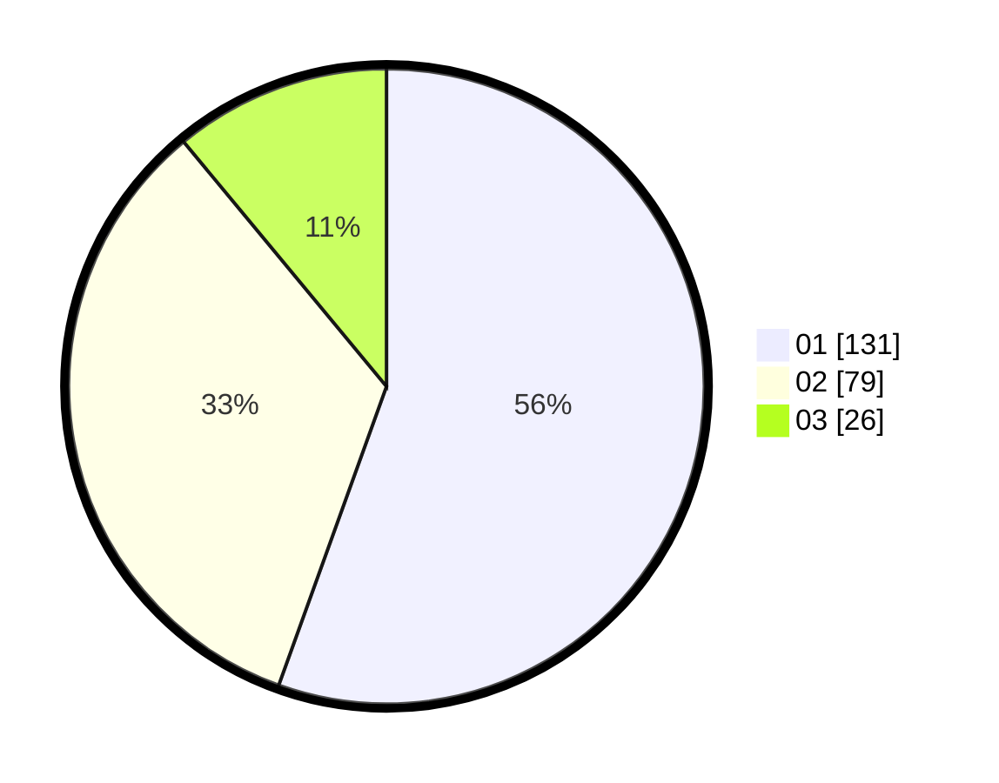

# Hasil

Hasil perolehan suara paslon dapat dilihat pada file paslon-01.txt, paslon-02.txt, dan paslon-03.txt.

Jika tidak ada, artinya data tersebut belum ada pada SIREKAP.

## Perolehan Suara

 * Paslon 01: **131**.
 * Paslon 02: **79**.
 * Paslon 03: **26**.

## Foto C Plano

https://sirekap-obj-formc.kpu.go.id/7fca/pemilu/ppwp/31/75/02/10/04/3175021004001-20240214-203858--11e8d00d-49b1-47e3-98d4-e8fc2bbdc9a0.jpg

https://sirekap-obj-formc.kpu.go.id/7fca/pemilu/ppwp/31/75/02/10/04/3175021004001-20240216-205526--f3cd507e-9cfe-40a4-a2ad-f459ab7c28b7.jpg

https://sirekap-obj-formc.kpu.go.id/7fca/pemilu/ppwp/31/75/02/10/04/3175021004001-20240216-205656--7e65d258-0aa4-428a-94d0-0746e0a89cc7.jpg

## DATA PEMILIH TETAP

Jumlah pemilih dalam DPT: **275**.
 * L: **133**.
 * P: **142**.

## DATA PENGGUNA HAK PILIH

Jumlah pengguna hak pilih dalam DPT: **235**.
 * L: **112**.
 * P: **123**.

Jumlah pengguna hak pilih dalam DPTb: **6**.
 * L: **3**.
 * P: **3**.

Jumlah pengguna hak pilih dalam DPK: **0**.
 * L: **0**.
 * P: **0**.

Jumlah pengguna hak pilih: **241**.
 * L: **115**.
 * P: **126**.

## JUMLAH SUARA SAH DAN TIDAK SAH

JUMLAH SELURUH SUARA SAH: **236**.

JUMLAH SUARA TIDAK SAH: **5**.

JUMLAH SELURUH SUARA SAH DAN SUARA TIDAK SAH: **241**.
