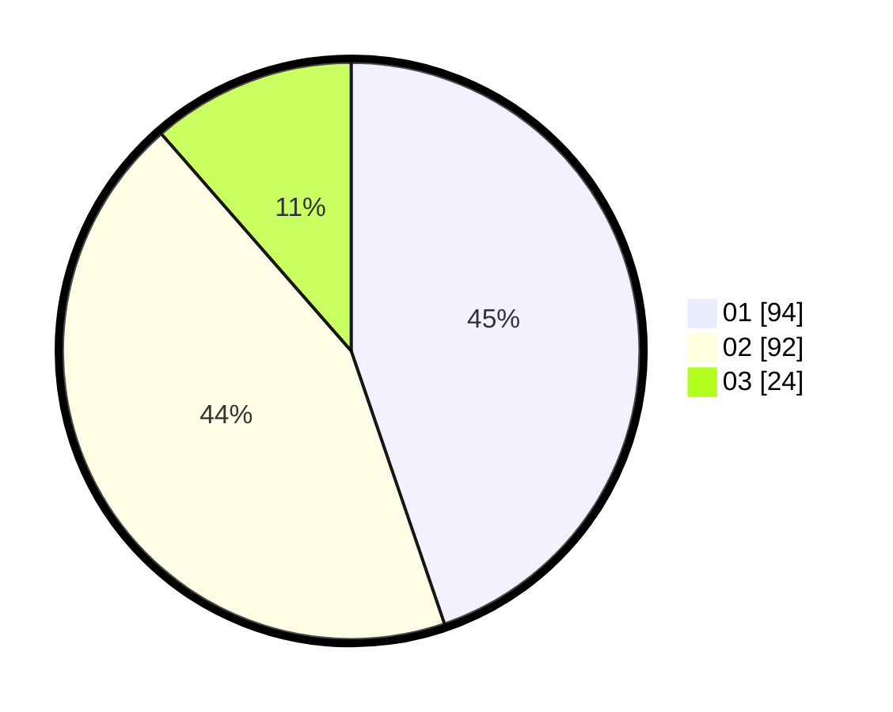

# Hasil

Hasil perolehan suara paslon dapat dilihat pada file paslon-01.txt, paslon-02.txt, dan paslon-03.txt.

Jika tidak ada, artinya data tersebut belum ada pada SIREKAP.

## Perolehan Suara

 * Paslon 01: **94**.
 * Paslon 02: **92**.
 * Paslon 03: **24**.

## Foto C Plano

https://sirekap-obj-formc.kpu.go.id/56c2/pemilu/ppwp/31/75/02/10/04/3175021004003-20240214-155837--25f0c367-943b-4dd1-805a-3dd1f5f98d5f.jpg

https://sirekap-obj-formc.kpu.go.id/56c2/pemilu/ppwp/31/75/02/10/04/3175021004003-20240214-160106--81ec08f7-da95-4763-9d1d-8392d58a9e19.jpg

https://sirekap-obj-formc.kpu.go.id/56c2/pemilu/ppwp/31/75/02/10/04/3175021004003-20240214-160111--f598fb0a-7233-42a4-bc96-fe95dcbe268a.jpg

## DATA PEMILIH TETAP

Jumlah pemilih dalam DPT: **275**.
 * L: **139**.
 * P: **136**.

## DATA PENGGUNA HAK PILIH

Jumlah pengguna hak pilih dalam DPT: **208**.
 * L: **100**.
 * P: **108**.

Jumlah pengguna hak pilih dalam DPTb: **1**.
 * L: **0**.
 * P: **1**.

Jumlah pengguna hak pilih dalam DPK: **2**.
 * L: **1**.
 * P: **1**.

Jumlah pengguna hak pilih: **211**.
 * L: **101**.
 * P: **110**.

## JUMLAH SUARA SAH DAN TIDAK SAH

JUMLAH SELURUH SUARA SAH: **210**.

JUMLAH SUARA TIDAK SAH: **1**.

JUMLAH SELURUH SUARA SAH DAN SUARA TIDAK SAH: **211**.
