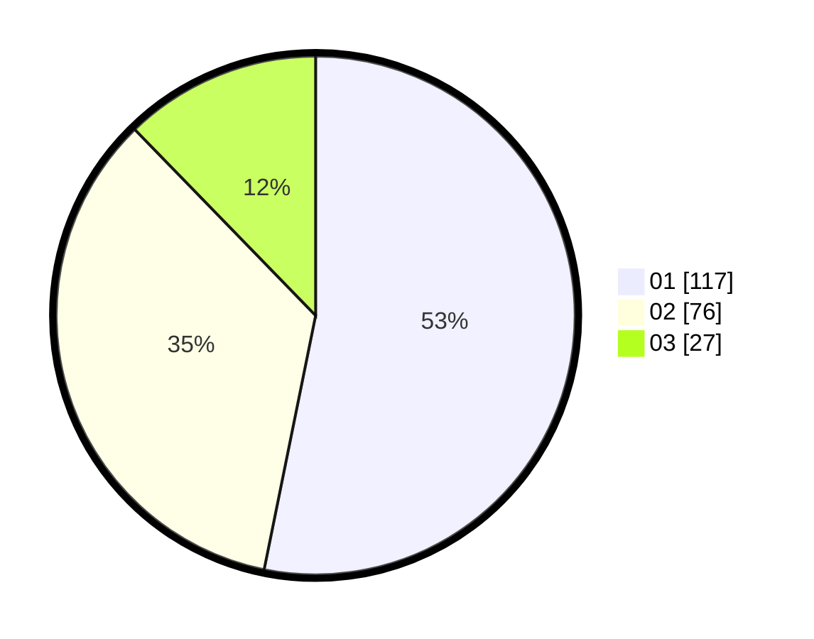

# Hasil

Hasil perolehan suara paslon dapat dilihat pada file paslon-01.txt, paslon-02.txt, dan paslon-03.txt.

Jika tidak ada, artinya data tersebut belum ada pada SIREKAP.

## Perolehan Suara

 * Paslon 01: **117**.
 * Paslon 02: **76**.
 * Paslon 03: **27**.

## Foto C Plano

https://sirekap-obj-formc.kpu.go.id/c75b/pemilu/ppwp/31/75/02/10/04/3175021004005-20240215-120129--1bf92c2d-65b0-4396-96f7-563fb9f0f15e.jpg

https://sirekap-obj-formc.kpu.go.id/c75b/pemilu/ppwp/31/75/02/10/04/3175021004005-20240215-120227--c679299f-8046-467b-954d-c87bc5a55533.jpg

https://sirekap-obj-formc.kpu.go.id/c75b/pemilu/ppwp/31/75/02/10/04/3175021004005-20240215-120313--ca131ca5-f207-4d1b-a576-1a2720d51677.jpg
