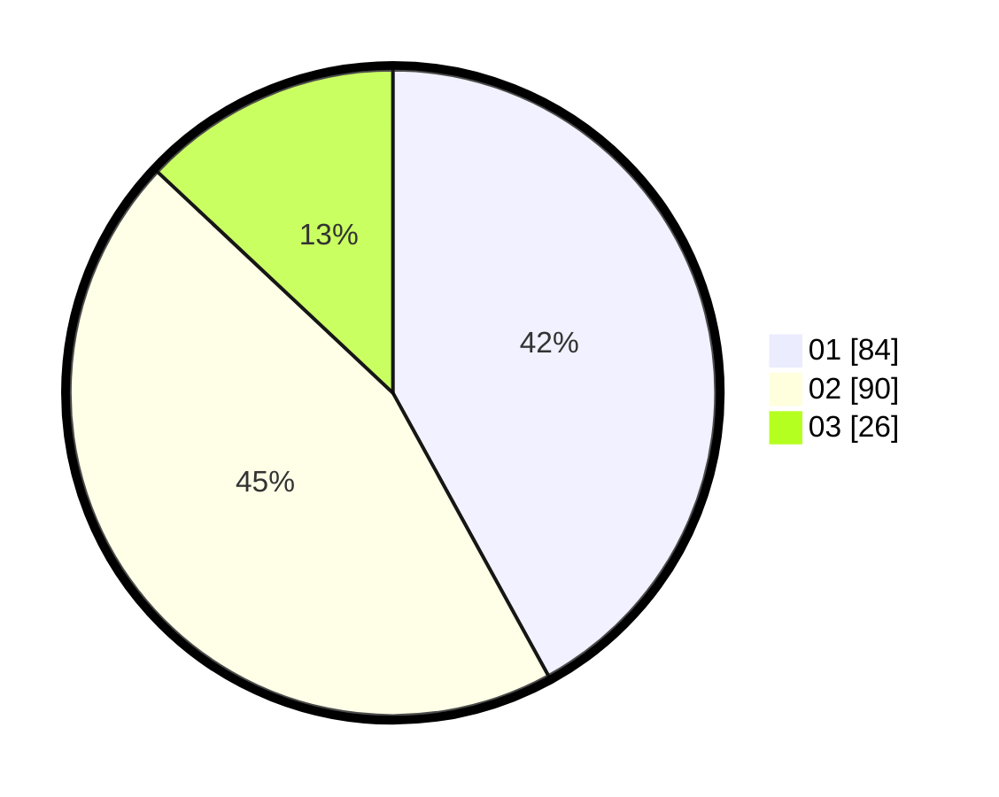

# Hasil

Hasil perolehan suara paslon dapat dilihat pada file paslon-01.txt, paslon-02.txt, dan paslon-03.txt.

Jika tidak ada, artinya data tersebut belum ada pada SIREKAP.

## Perolehan Suara

 * Paslon 01: **84**.
 * Paslon 02: **90**.
 * Paslon 03: **26**.

## Foto C Plano

https://sirekap-obj-formc.kpu.go.id/fbef/pemilu/ppwp/31/75/02/10/04/3175021004009-20240216-134616--3c0948dc-7e17-4506-8fb6-6b8671a2132c.jpg

https://sirekap-obj-formc.kpu.go.id/fbef/pemilu/ppwp/31/75/02/10/04/3175021004009-20240214-155155--d772604a-b4e3-438d-9524-ae2fc90731f7.jpg

https://sirekap-obj-formc.kpu.go.id/fbef/pemilu/ppwp/31/75/02/10/04/3175021004009-20240216-134617--95cc8e02-0fad-4186-9429-2e3d52318be1.jpg

## DATA PEMILIH TETAP

Jumlah pemilih dalam DPT: **270**.
 * L: **133**.
 * P: **137**.

## DATA PENGGUNA HAK PILIH

Jumlah pengguna hak pilih dalam DPT: **198**.
 * L: **89**.
 * P: **109**.

Jumlah pengguna hak pilih dalam DPTb: **4**.
 * L: **4**.
 * P: **0**.

Jumlah pengguna hak pilih dalam DPK: **0**.
 * L: **0**.
 * P: **0**.

Jumlah pengguna hak pilih: **202**.
 * L: **93**.
 * P: **109**.

## JUMLAH SUARA SAH DAN TIDAK SAH

JUMLAH SELURUH SUARA SAH: **200**.

JUMLAH SUARA TIDAK SAH: **2**.

JUMLAH SELURUH SUARA SAH DAN SUARA TIDAK SAH: **202**.
