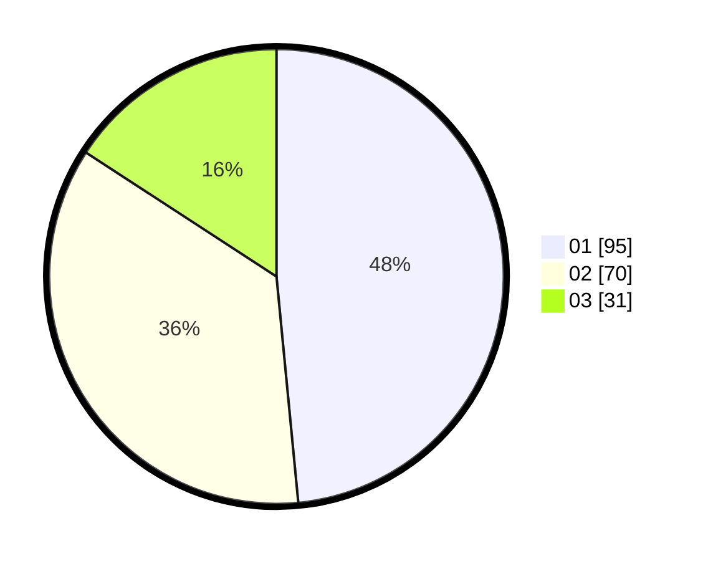

# Hasil

Hasil perolehan suara paslon dapat dilihat pada file paslon-01.txt, paslon-02.txt, dan paslon-03.txt.

Jika tidak ada, artinya data tersebut belum ada pada SIREKAP.

## Perolehan Suara

 * Paslon 01: **95**.
 * Paslon 02: **70**.
 * Paslon 03: **31**.

## Foto C Plano

https://sirekap-obj-formc.kpu.go.id/af6d/pemilu/ppwp/31/75/02/10/04/3175021004011-20240216-062042--4dd5c82f-c160-4277-b668-d01c602ae43c.jpg

https://sirekap-obj-formc.kpu.go.id/af6d/pemilu/ppwp/31/75/02/10/04/3175021004011-20240216-062634--5d85fced-6c25-4360-ad25-7729b3365253.jpg

https://sirekap-obj-formc.kpu.go.id/af6d/pemilu/ppwp/31/75/02/10/04/3175021004011-20240216-062046--d642459f-56c5-4e67-a730-93c6bb4515ea.jpg

## DATA PEMILIH TETAP

Jumlah pemilih dalam DPT: **275**.
 * L: **132**.
 * P: **143**.

## DATA PENGGUNA HAK PILIH

Jumlah pengguna hak pilih dalam DPT: **196**.
 * L: **89**.
 * P: **107**.

Jumlah pengguna hak pilih dalam DPTb: **3**.
 * L: **2**.
 * P: **1**.

Jumlah pengguna hak pilih dalam DPK: **0**.
 * L: **0**.
 * P: **0**.

Jumlah pengguna hak pilih: **199**.
 * L: **91**.
 * P: **108**.

## JUMLAH SUARA SAH DAN TIDAK SAH

JUMLAH SELURUH SUARA SAH: **196**.

JUMLAH SUARA TIDAK SAH: **3**.

JUMLAH SELURUH SUARA SAH DAN SUARA TIDAK SAH: **199**.
