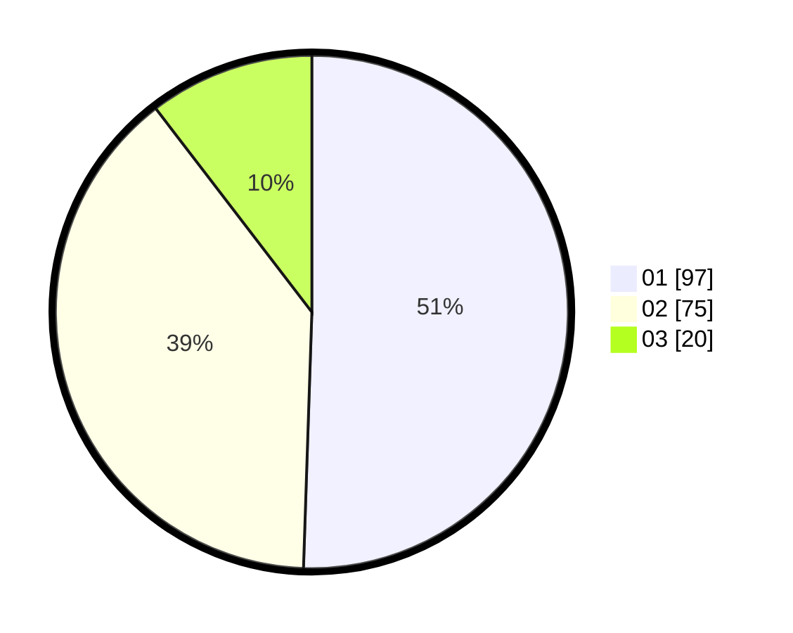

# Hasil

Hasil perolehan suara paslon dapat dilihat pada file paslon-01.txt, paslon-02.txt, dan paslon-03.txt.

Jika tidak ada, artinya data tersebut belum ada pada SIREKAP.

## Perolehan Suara

 * Paslon 01: **97**.
 * Paslon 02: **75**.
 * Paslon 03: **20**.

## Foto C Plano

https://sirekap-obj-formc.kpu.go.id/36a6/pemilu/ppwp/31/75/02/10/04/3175021004014-20240216-095844--9a5042cf-1891-4f2a-b2c9-a7fe204ccb09.jpg

https://sirekap-obj-formc.kpu.go.id/36a6/pemilu/ppwp/31/75/02/10/04/3175021004014-20240216-093246--dc7e97e7-4936-41ef-973f-83347134a026.jpg

https://sirekap-obj-formc.kpu.go.id/36a6/pemilu/ppwp/31/75/02/10/04/3175021004014-20240216-093240--6d517d64-2123-4a03-9b42-39e89bec122b.jpg

## DATA PEMILIH TETAP

Jumlah pemilih dalam DPT: **263**.
 * L: **131**.
 * P: **132**.

## DATA PENGGUNA HAK PILIH

Jumlah pengguna hak pilih dalam DPT: **195**.
 * L: **98**.
 * P: **97**.

Jumlah pengguna hak pilih dalam DPTb: **0**.
 * L: **0**.
 * P: **0**.

Jumlah pengguna hak pilih dalam DPK: **0**.
 * L: **0**.
 * P: **0**.

Jumlah pengguna hak pilih: **195**.
 * L: **98**.
 * P: **97**.

## JUMLAH SUARA SAH DAN TIDAK SAH

JUMLAH SELURUH SUARA SAH: **192**.

JUMLAH SUARA TIDAK SAH: **3**.

JUMLAH SELURUH SUARA SAH DAN SUARA TIDAK SAH: **195**.
