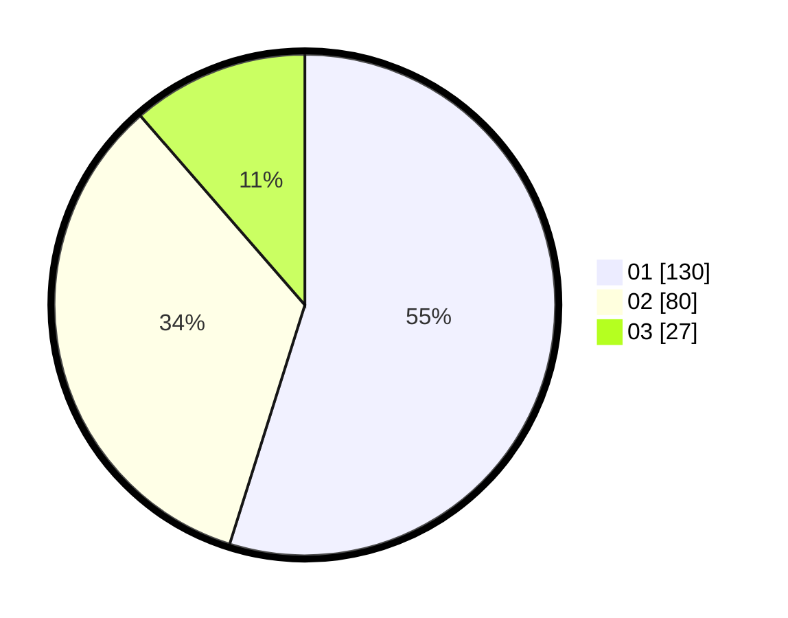

# Hasil

Hasil perolehan suara paslon dapat dilihat pada file paslon-01.txt, paslon-02.txt, dan paslon-03.txt.

Jika tidak ada, artinya data tersebut belum ada pada SIREKAP.

## Perolehan Suara

 * Paslon 01: **130**.
 * Paslon 02: **80**.
 * Paslon 03: **27**.

## Foto C Plano

https://sirekap-obj-formc.kpu.go.id/c1bc/pemilu/ppwp/31/75/02/10/04/3175021004016-20240216-010150--fe99a41e-c695-4203-bbaa-0ea27406e60c.jpg

https://sirekap-obj-formc.kpu.go.id/c1bc/pemilu/ppwp/31/75/02/10/04/3175021004016-20240216-010152--71db0e0d-1e3e-4a82-bd21-c79c355fda84.jpg

https://sirekap-obj-formc.kpu.go.id/c1bc/pemilu/ppwp/31/75/02/10/04/3175021004016-20240216-010151--8eb372c9-e3db-49c1-a170-1c3c667c2a77.jpg

## DATA PEMILIH TETAP

Jumlah pemilih dalam DPT: **286**.
 * L: **140**.
 * P: **146**.

## DATA PENGGUNA HAK PILIH

Jumlah pengguna hak pilih dalam DPT: **237**.
 * L: **113**.
 * P: **124**.

Jumlah pengguna hak pilih dalam DPTb: **0**.
 * L: **0**.
 * P: **0**.

Jumlah pengguna hak pilih dalam DPK: **0**.
 * L: **0**.
 * P: **0**.

Jumlah pengguna hak pilih: **237**.
 * L: **113**.
 * P: **124**.

## JUMLAH SUARA SAH DAN TIDAK SAH

JUMLAH SELURUH SUARA SAH: **237**.

JUMLAH SUARA TIDAK SAH: **0**.

JUMLAH SELURUH SUARA SAH DAN SUARA TIDAK SAH: **237**.
