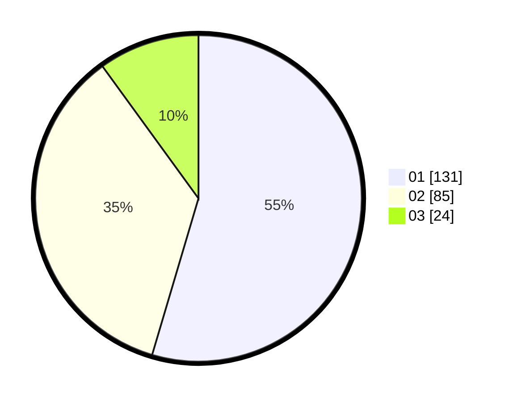

# Hasil

Hasil perolehan suara paslon dapat dilihat pada file paslon-01.txt, paslon-02.txt, dan paslon-03.txt.

Jika tidak ada, artinya data tersebut belum ada pada SIREKAP.

## Perolehan Suara

 * Paslon 01: **131**.
 * Paslon 02: **85**.
 * Paslon 03: **24**.

## Foto C Plano

https://sirekap-obj-formc.kpu.go.id/0490/pemilu/ppwp/31/75/02/10/04/3175021004019-20240214-205412--55111a95-30d8-4194-8825-fbd180555d72.jpg

https://sirekap-obj-formc.kpu.go.id/0490/pemilu/ppwp/31/75/02/10/04/3175021004019-20240214-205608--4d480ff8-fd6e-4aa0-9527-85c5e95cb1ea.jpg

https://sirekap-obj-formc.kpu.go.id/0490/pemilu/ppwp/31/75/02/10/04/3175021004019-20240215-015344--40c09631-7882-4f56-93bf-5f9bd73e4371.jpg
