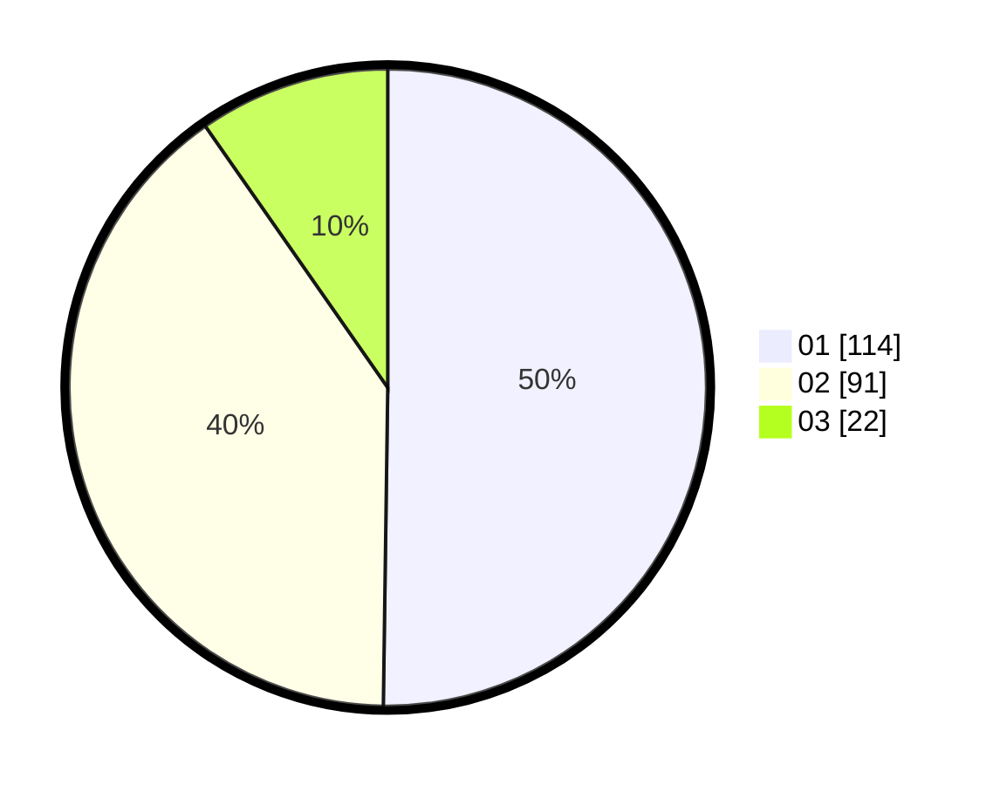

# Hasil

Hasil perolehan suara paslon dapat dilihat pada file paslon-01.txt, paslon-02.txt, dan paslon-03.txt.

Jika tidak ada, artinya data tersebut belum ada pada SIREKAP.

## Perolehan Suara

 * Paslon 01: **114**.
 * Paslon 02: **91**.
 * Paslon 03: **22**.

## Foto C Plano

https://sirekap-obj-formc.kpu.go.id/6078/pemilu/ppwp/31/75/02/10/04/3175021004022-20240214-195038--0c24a029-ee87-4c17-ab2c-cc0df9f20b1d.jpg

https://sirekap-obj-formc.kpu.go.id/6078/pemilu/ppwp/31/75/02/10/04/3175021004022-20240214-224819--8c09bf6d-0ceb-4241-ba1c-c70cd2c55e12.jpg

https://sirekap-obj-formc.kpu.go.id/6078/pemilu/ppwp/31/75/02/10/04/3175021004022-20240214-195306--39657365-e975-476c-a556-972f8beea6aa.jpg

## DATA PEMILIH TETAP

Jumlah pemilih dalam DPT: **277**.
 * L: **146**.
 * P: **131**.

## DATA PENGGUNA HAK PILIH

Jumlah pengguna hak pilih dalam DPT: **226**.
 * L: **121**.
 * P: **105**.

Jumlah pengguna hak pilih dalam DPTb: **2**.
 * L: **2**.
 * P: **0**.

Jumlah pengguna hak pilih dalam DPK: **0**.
 * L: **0**.
 * P: **0**.

Jumlah pengguna hak pilih: **228**.
 * L: **123**.
 * P: **105**.

## JUMLAH SUARA SAH DAN TIDAK SAH

JUMLAH SELURUH SUARA SAH: **227**.

JUMLAH SUARA TIDAK SAH: **1**.

JUMLAH SELURUH SUARA SAH DAN SUARA TIDAK SAH: **228**.
