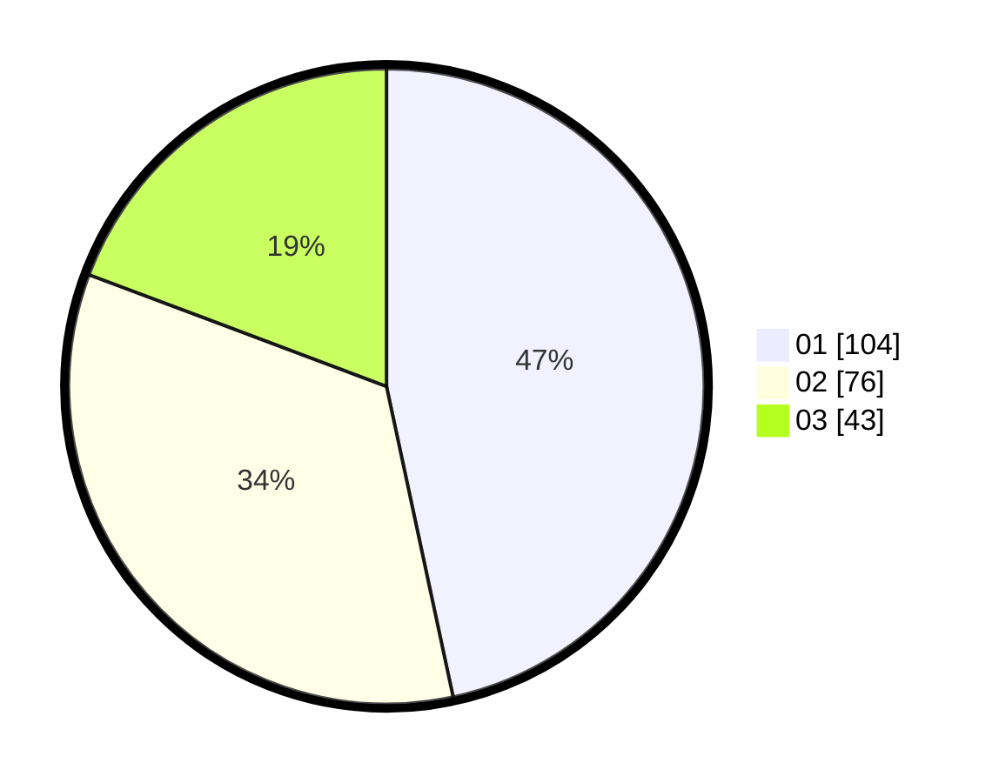

# Hasil

Hasil perolehan suara paslon dapat dilihat pada file paslon-01.txt, paslon-02.txt, dan paslon-03.txt.

Jika tidak ada, artinya data tersebut belum ada pada SIREKAP.

## Perolehan Suara

 * Paslon 01: **104**.
 * Paslon 02: **76**.
 * Paslon 03: **43**.

## Foto C Plano

https://sirekap-obj-formc.kpu.go.id/5d01/pemilu/ppwp/31/75/02/10/04/3175021004023-20240216-132448--52e5691b-9403-4a3b-9e77-0af1531c1609.jpg

https://sirekap-obj-formc.kpu.go.id/5d01/pemilu/ppwp/31/75/02/10/04/3175021004023-20240216-132450--9f86d4e1-7681-4abc-9203-5cc07b448880.jpg

https://sirekap-obj-formc.kpu.go.id/5d01/pemilu/ppwp/31/75/02/10/04/3175021004023-20240216-132449--a3d204ce-8c9c-45b1-b78b-9dbba065a9aa.jpg

## DATA PEMILIH TETAP

Jumlah pemilih dalam DPT: **271**.
 * L: **128**.
 * P: **143**.

## DATA PENGGUNA HAK PILIH

Jumlah pengguna hak pilih dalam DPT: **223**.
 * L: **102**.
 * P: **121**.

Jumlah pengguna hak pilih dalam DPTb: **0**.
 * L: **1**.
 * P: **0**.

Jumlah pengguna hak pilih dalam DPK: **0**.
 * L: **0**.
 * P: **1**.

Jumlah pengguna hak pilih: **225**.
 * L: **103**.
 * P: **122**.

## JUMLAH SUARA SAH DAN TIDAK SAH

JUMLAH SELURUH SUARA SAH: **223**.

JUMLAH SUARA TIDAK SAH: **2**.

JUMLAH SELURUH SUARA SAH DAN SUARA TIDAK SAH: **225**.
