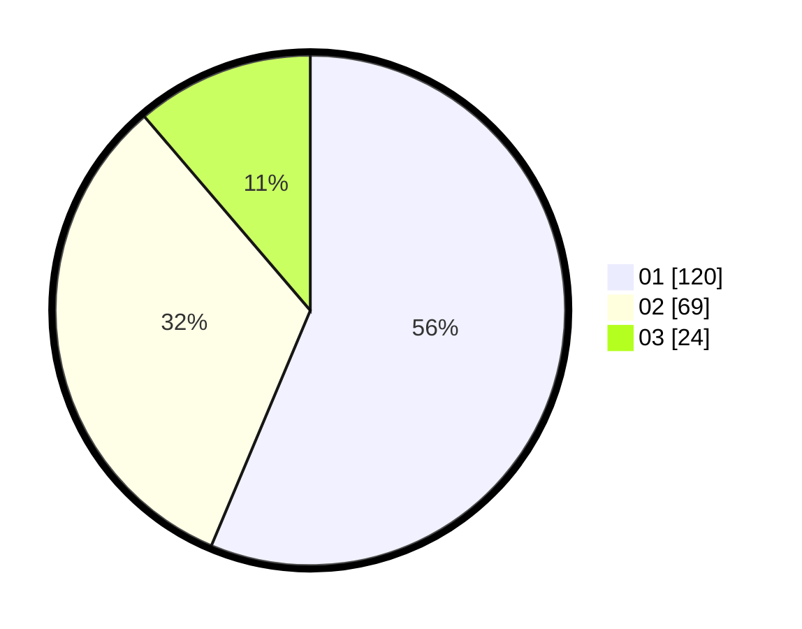

# Hasil

Hasil perolehan suara paslon dapat dilihat pada file paslon-01.txt, paslon-02.txt, dan paslon-03.txt.

Jika tidak ada, artinya data tersebut belum ada pada SIREKAP.

## Perolehan Suara

 * Paslon 01: **120**.
 * Paslon 02: **69**.
 * Paslon 03: **24**.

## Foto C Plano

https://sirekap-obj-formc.kpu.go.id/aabe/pemilu/ppwp/31/75/02/10/04/3175021004025-20240215-220037--3abcbb42-719e-411e-84d9-842a85d0a0f5.jpg

https://sirekap-obj-formc.kpu.go.id/aabe/pemilu/ppwp/31/75/02/10/04/3175021004025-20240215-220041--fc5c896c-351a-4644-931e-ef50335e545b.jpg

https://sirekap-obj-formc.kpu.go.id/aabe/pemilu/ppwp/31/75/02/10/04/3175021004025-20240215-220039--a3e87c54-ebcc-4230-84c2-50ef3cafb274.jpg

## DATA PEMILIH TETAP

Jumlah pemilih dalam DPT: **281**.
 * L: **135**.
 * P: **146**.

## DATA PENGGUNA HAK PILIH

Jumlah pengguna hak pilih dalam DPT: **214**.
 * L: **104**.
 * P: **110**.

Jumlah pengguna hak pilih dalam DPTb: **2**.
 * L: **1**.
 * P: **1**.

Jumlah pengguna hak pilih dalam DPK: **0**.
 * L: **0**.
 * P: **0**.

Jumlah pengguna hak pilih: **216**.
 * L: **105**.
 * P: **111**.

## JUMLAH SUARA SAH DAN TIDAK SAH

JUMLAH SELURUH SUARA SAH: **213**.

JUMLAH SUARA TIDAK SAH: **3**.

JUMLAH SELURUH SUARA SAH DAN SUARA TIDAK SAH: **216**.
