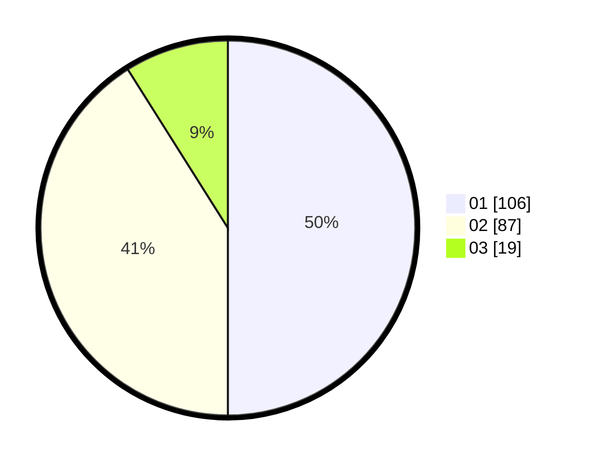

# Hasil

Hasil perolehan suara paslon dapat dilihat pada file paslon-01.txt, paslon-02.txt, dan paslon-03.txt.

Jika tidak ada, artinya data tersebut belum ada pada SIREKAP.

## Perolehan Suara

 * Paslon 01: **106**.
 * Paslon 02: **87**.
 * Paslon 03: **19**.

## Foto C Plano

https://sirekap-obj-formc.kpu.go.id/44ca/pemilu/ppwp/31/75/02/10/04/3175021004037-20240216-134741--73bc6c24-837c-419c-a0fe-dd1206e2eb6e.jpg

https://sirekap-obj-formc.kpu.go.id/44ca/pemilu/ppwp/31/75/02/10/04/3175021004037-20240214-155809--645b861f-15d2-4cfc-9504-ed29406963a8.jpg

https://sirekap-obj-formc.kpu.go.id/44ca/pemilu/ppwp/31/75/02/10/04/3175021004037-20240216-134742--f7f11023-13cd-4008-aff8-454093f98c86.jpg

## DATA PEMILIH TETAP

Jumlah pemilih dalam DPT: **0**.
 * L: **0**.
 * P: **0**.

## DATA PENGGUNA HAK PILIH

Jumlah pengguna hak pilih dalam DPT: **0**.
 * L: **0**.
 * P: **0**.

Jumlah pengguna hak pilih dalam DPTb: **0**.
 * L: **0**.
 * P: **0**.

Jumlah pengguna hak pilih dalam DPK: **0**.
 * L: **0**.
 * P: **0**.

Jumlah pengguna hak pilih: **0**.
 * L: **0**.
 * P: **0**.

## JUMLAH SUARA SAH DAN TIDAK SAH

JUMLAH SELURUH SUARA SAH: **0**.

JUMLAH SUARA TIDAK SAH: **0**.

JUMLAH SELURUH SUARA SAH DAN SUARA TIDAK SAH: **0**.
