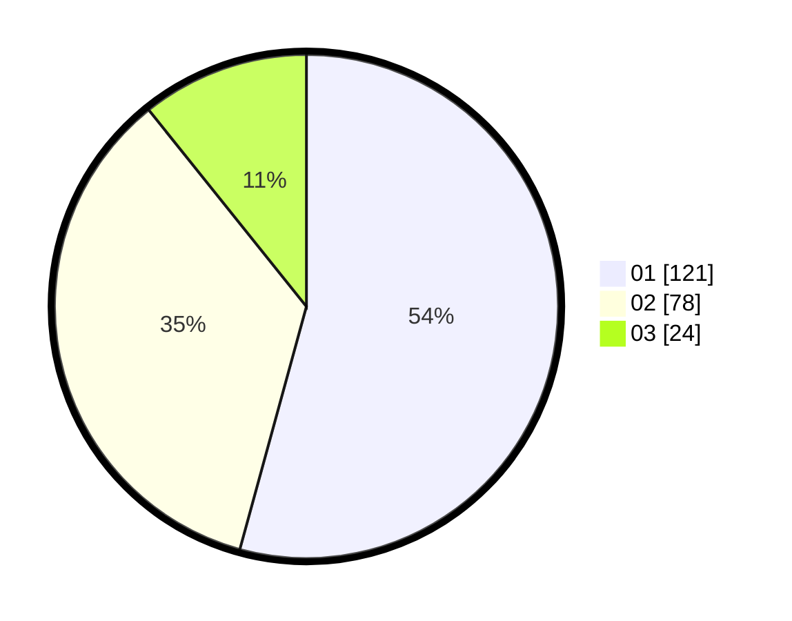

# Hasil

Hasil perolehan suara paslon dapat dilihat pada file paslon-01.txt, paslon-02.txt, dan paslon-03.txt.

Jika tidak ada, artinya data tersebut belum ada pada SIREKAP.

## Perolehan Suara

 * Paslon 01: **121**.
 * Paslon 02: **78**.
 * Paslon 03: **24**.

## Foto C Plano

https://sirekap-obj-formc.kpu.go.id/6083/pemilu/ppwp/31/75/02/10/04/3175021004040-20240216-125531--83608154-4482-43b3-886a-23faea1fb5f5.jpg

https://sirekap-obj-formc.kpu.go.id/6083/pemilu/ppwp/31/75/02/10/04/3175021004040-20240216-125533--3a11a376-d2c7-4438-b3a5-c03be625b4ca.jpg

https://sirekap-obj-formc.kpu.go.id/6083/pemilu/ppwp/31/75/02/10/04/3175021004040-20240216-125532--23f346da-31af-410a-a9c2-2652593c90a5.jpg

## DATA PEMILIH TETAP

Jumlah pemilih dalam DPT: **272**.
 * L: **138**.
 * P: **134**.

## DATA PENGGUNA HAK PILIH

Jumlah pengguna hak pilih dalam DPT: **216**.
 * L: **106**.
 * P: **110**.

Jumlah pengguna hak pilih dalam DPTb: **2**.
 * L: **1**.
 * P: **1**.

Jumlah pengguna hak pilih dalam DPK: **9**.
 * L: **4**.
 * P: **5**.

Jumlah pengguna hak pilih: **227**.
 * L: **111**.
 * P: **116**.

## JUMLAH SUARA SAH DAN TIDAK SAH

JUMLAH SELURUH SUARA SAH: **223**.

JUMLAH SUARA TIDAK SAH: **4**.

JUMLAH SELURUH SUARA SAH DAN SUARA TIDAK SAH: **227**.
