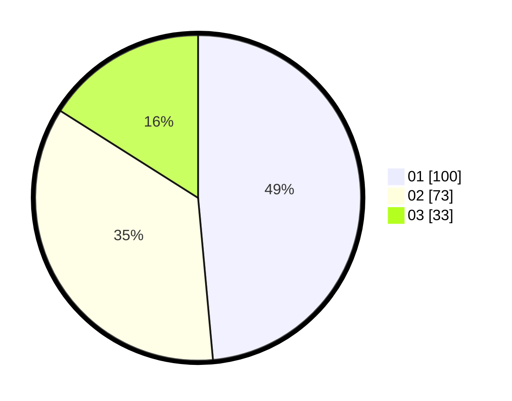

# Hasil

Hasil perolehan suara paslon dapat dilihat pada file paslon-01.txt, paslon-02.txt, dan paslon-03.txt.

Jika tidak ada, artinya data tersebut belum ada pada SIREKAP.

## Perolehan Suara

 * Paslon 01: **100**.
 * Paslon 02: **73**.
 * Paslon 03: **33**.

## Foto C Plano

https://sirekap-obj-formc.kpu.go.id/6e5f/pemilu/ppwp/31/75/02/10/04/3175021004041-20240216-135117--7040f874-162a-4fe3-9dae-733e2bcc7694.jpg

https://sirekap-obj-formc.kpu.go.id/6e5f/pemilu/ppwp/31/75/02/10/04/3175021004041-20240216-135118--4fa50632-4759-43d8-a490-36d04c292f92.jpg

https://sirekap-obj-formc.kpu.go.id/6e5f/pemilu/ppwp/31/75/02/10/04/3175021004041-20240215-012343--b0eefad4-e329-48fd-b79a-59944426ef43.jpg

## DATA PEMILIH TETAP

Jumlah pemilih dalam DPT: **271**.
 * L: **138**.
 * P: **133**.

## DATA PENGGUNA HAK PILIH

Jumlah pengguna hak pilih dalam DPT: **204**.
 * L: **94**.
 * P: **110**.

Jumlah pengguna hak pilih dalam DPTb: **4**.
 * L: **2**.
 * P: **2**.

Jumlah pengguna hak pilih dalam DPK: **1**.
 * L: **0**.
 * P: **1**.

Jumlah pengguna hak pilih: **209**.
 * L: **96**.
 * P: **113**.

## JUMLAH SUARA SAH DAN TIDAK SAH

JUMLAH SELURUH SUARA SAH: **206**.

JUMLAH SUARA TIDAK SAH: **3**.

JUMLAH SELURUH SUARA SAH DAN SUARA TIDAK SAH: **209**.
