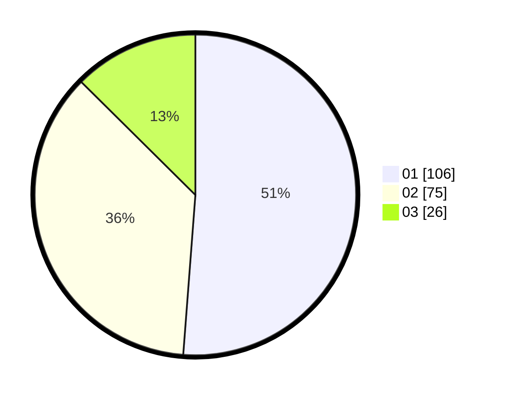

# Hasil

Hasil perolehan suara paslon dapat dilihat pada file paslon-01.txt, paslon-02.txt, dan paslon-03.txt.

Jika tidak ada, artinya data tersebut belum ada pada SIREKAP.

## Perolehan Suara

 * Paslon 01: **106**.
 * Paslon 02: **75**.
 * Paslon 03: **26**.

## Foto C Plano

https://sirekap-obj-formc.kpu.go.id/acad/pemilu/ppwp/31/75/02/10/04/3175021004043-20240215-033631--eb2a01b3-158b-45bd-be87-f05db573fa11.jpg

https://sirekap-obj-formc.kpu.go.id/acad/pemilu/ppwp/31/75/02/10/04/3175021004043-20240215-033653--a08eabfa-6623-4300-88ec-d5d9e6608caa.jpg

https://sirekap-obj-formc.kpu.go.id/acad/pemilu/ppwp/31/75/02/10/04/3175021004043-20240215-033643--639e7e1e-809c-4558-8993-e5cd590ee892.jpg

## DATA PEMILIH TETAP

Jumlah pemilih dalam DPT: **269**.
 * L: **134**.
 * P: **135**.

## DATA PENGGUNA HAK PILIH

Jumlah pengguna hak pilih dalam DPT: **206**.
 * L: **94**.
 * P: **112**.

Jumlah pengguna hak pilih dalam DPTb: **0**.
 * L: **0**.
 * P: **0**.

Jumlah pengguna hak pilih dalam DPK: **6**.
 * L: **3**.
 * P: **3**.

Jumlah pengguna hak pilih: **212**.
 * L: **97**.
 * P: **115**.

## JUMLAH SUARA SAH DAN TIDAK SAH

JUMLAH SELURUH SUARA SAH: **207**.

JUMLAH SUARA TIDAK SAH: **5**.

JUMLAH SELURUH SUARA SAH DAN SUARA TIDAK SAH: **212**.
