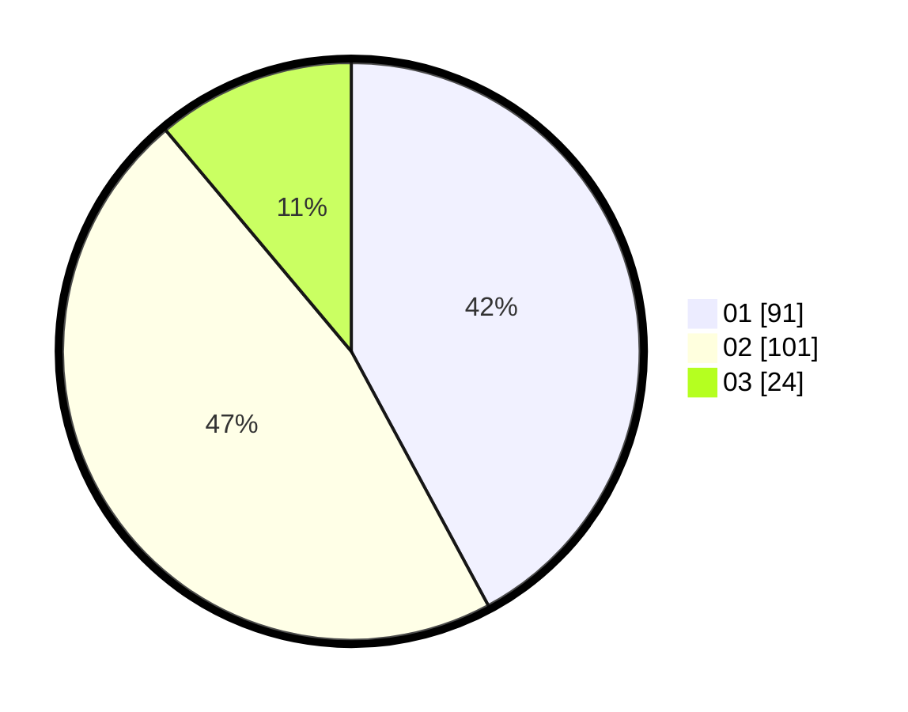

# Hasil

Hasil perolehan suara paslon dapat dilihat pada file paslon-01.txt, paslon-02.txt, dan paslon-03.txt.

Jika tidak ada, artinya data tersebut belum ada pada SIREKAP.

## Perolehan Suara

 * Paslon 01: **91**.
 * Paslon 02: **101**.
 * Paslon 03: **24**.

## Foto C Plano

https://sirekap-obj-formc.kpu.go.id/82ed/pemilu/ppwp/31/75/02/10/04/3175021004044-20240216-141025--a3ab1b6b-f2d0-405d-81ab-2bb90759c8a3.jpg

https://sirekap-obj-formc.kpu.go.id/82ed/pemilu/ppwp/31/75/02/10/04/3175021004044-20240216-141026--5c67287a-2c6d-409c-a080-d434236bb10e.jpg

https://sirekap-obj-formc.kpu.go.id/82ed/pemilu/ppwp/31/75/02/10/04/3175021004044-20240216-141026--c1156038-b19d-4de4-8e72-213dbd0b3ce7.jpg

## DATA PEMILIH TETAP

Jumlah pemilih dalam DPT: **0**.
 * L: **0**.
 * P: **0**.

## DATA PENGGUNA HAK PILIH

Jumlah pengguna hak pilih dalam DPT: **0**.
 * L: **0**.
 * P: **0**.

Jumlah pengguna hak pilih dalam DPTb: **0**.
 * L: **0**.
 * P: **0**.

Jumlah pengguna hak pilih dalam DPK: **0**.
 * L: **0**.
 * P: **0**.

Jumlah pengguna hak pilih: **0**.
 * L: **0**.
 * P: **0**.

## JUMLAH SUARA SAH DAN TIDAK SAH

JUMLAH SELURUH SUARA SAH: **215**.

JUMLAH SUARA TIDAK SAH: **6**.

JUMLAH SELURUH SUARA SAH DAN SUARA TIDAK SAH: **221**.
