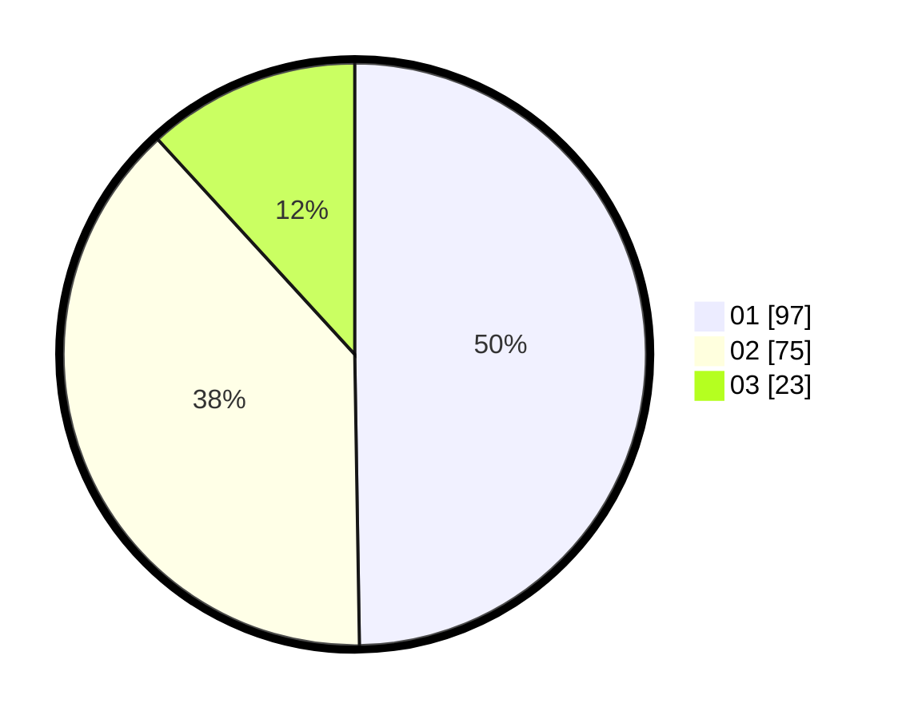

# Hasil

Hasil perolehan suara paslon dapat dilihat pada file paslon-01.txt, paslon-02.txt, dan paslon-03.txt.

Jika tidak ada, artinya data tersebut belum ada pada SIREKAP.

## Perolehan Suara

 * Paslon 01: **97**.
 * Paslon 02: **75**.
 * Paslon 03: **23**.

## Foto C Plano

https://sirekap-obj-formc.kpu.go.id/5645/pemilu/ppwp/31/75/02/10/04/3175021004046-20240216-153853--e4c555f5-a3f2-4b75-a5b2-9751080dae19.jpg

https://sirekap-obj-formc.kpu.go.id/5645/pemilu/ppwp/31/75/02/10/04/3175021004046-20240216-153854--024302de-03b1-45ab-b1cf-62d0dd499062.jpg

https://sirekap-obj-formc.kpu.go.id/5645/pemilu/ppwp/31/75/02/10/04/3175021004046-20240216-153854--9f8366e9-5205-46ec-959b-9cd0b07be806.jpg

## DATA PEMILIH TETAP

Jumlah pemilih dalam DPT: **267**.
 * L: **138**.
 * P: **129**.

## DATA PENGGUNA HAK PILIH

Jumlah pengguna hak pilih dalam DPT: **195**.
 * L: **96**.
 * P: **99**.

Jumlah pengguna hak pilih dalam DPTb: **0**.
 * L: **0**.
 * P: **0**.

Jumlah pengguna hak pilih dalam DPK: **0**.
 * L: **0**.
 * P: **0**.

Jumlah pengguna hak pilih: **195**.
 * L: **96**.
 * P: **99**.

## JUMLAH SUARA SAH DAN TIDAK SAH

JUMLAH SELURUH SUARA SAH: **195**.

JUMLAH SUARA TIDAK SAH: **0**.

JUMLAH SELURUH SUARA SAH DAN SUARA TIDAK SAH: **195**.
