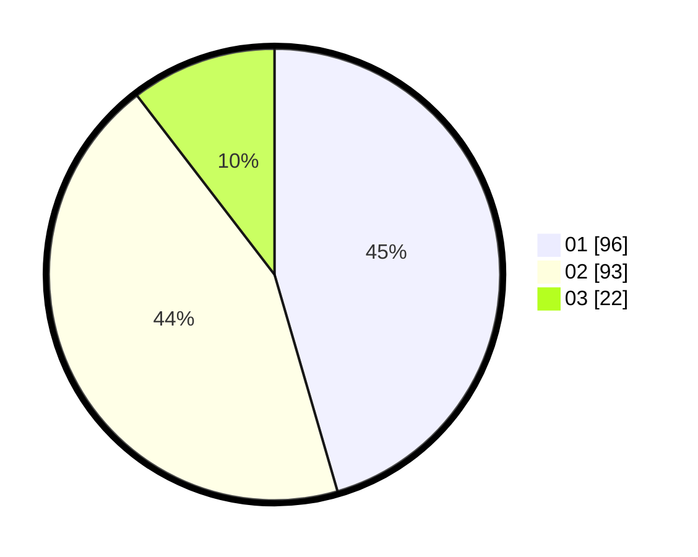

# Hasil

Hasil perolehan suara paslon dapat dilihat pada file paslon-01.txt, paslon-02.txt, dan paslon-03.txt.

Jika tidak ada, artinya data tersebut belum ada pada SIREKAP.

## Perolehan Suara

 * Paslon 01: **96**.
 * Paslon 02: **93**.
 * Paslon 03: **22**.

## Foto C Plano

https://sirekap-obj-formc.kpu.go.id/4a99/pemilu/ppwp/31/75/02/10/04/3175021004047-20240216-172840--4e64358d-17e5-4d25-8f3a-d0cf36752c32.jpg

https://sirekap-obj-formc.kpu.go.id/4a99/pemilu/ppwp/31/75/02/10/04/3175021004047-20240214-155426--1679f57d-edd7-43ca-b151-44d7c66fe91c.jpg

https://sirekap-obj-formc.kpu.go.id/4a99/pemilu/ppwp/31/75/02/10/04/3175021004047-20240214-155439--e77ed0cc-3838-44b3-86da-744917e12e11.jpg

## DATA PEMILIH TETAP

Jumlah pemilih dalam DPT: **269**.
 * L: **129**.
 * P: **140**.

## DATA PENGGUNA HAK PILIH

Jumlah pengguna hak pilih dalam DPT: **210**.
 * L: **98**.
 * P: **112**.

Jumlah pengguna hak pilih dalam DPTb: **0**.
 * L: **0**.
 * P: **0**.

Jumlah pengguna hak pilih dalam DPK: **5**.
 * L: **1**.
 * P: **4**.

Jumlah pengguna hak pilih: **215**.
 * L: **99**.
 * P: **116**.

## JUMLAH SUARA SAH DAN TIDAK SAH

JUMLAH SELURUH SUARA SAH: **211**.

JUMLAH SUARA TIDAK SAH: **4**.

JUMLAH SELURUH SUARA SAH DAN SUARA TIDAK SAH: **215**.
