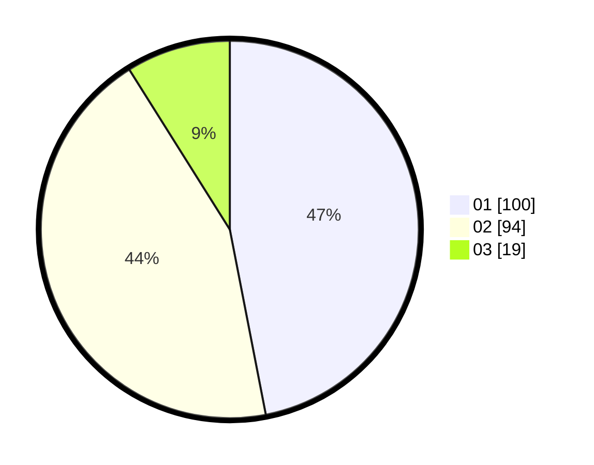

# Hasil

Hasil perolehan suara paslon dapat dilihat pada file paslon-01.txt, paslon-02.txt, dan paslon-03.txt.

Jika tidak ada, artinya data tersebut belum ada pada SIREKAP.

## Perolehan Suara

 * Paslon 01: **100**.
 * Paslon 02: **94**.
 * Paslon 03: **19**.

## Foto C Plano

https://sirekap-obj-formc.kpu.go.id/3e3e/pemilu/ppwp/31/75/02/10/04/3175021004049-20240214-155838--637fc30a-0734-483a-bf1c-d06148777435.jpg

https://sirekap-obj-formc.kpu.go.id/3e3e/pemilu/ppwp/31/75/02/10/04/3175021004049-20240214-160055--4469265f-d638-43c9-ab86-dfbc2fc5d0af.jpg

https://sirekap-obj-formc.kpu.go.id/3e3e/pemilu/ppwp/31/75/02/10/04/3175021004049-20240214-223011--7f677f05-cdbf-4ae6-a594-f380ce40fe7f.jpg

## DATA PEMILIH TETAP

Jumlah pemilih dalam DPT: **272**.
 * L: **151**.
 * P: **121**.

## DATA PENGGUNA HAK PILIH

Jumlah pengguna hak pilih dalam DPT: **219**.
 * L: **105**.
 * P: **114**.

Jumlah pengguna hak pilih dalam DPTb: **0**.
 * L: **0**.
 * P: **0**.

Jumlah pengguna hak pilih dalam DPK: **0**.
 * L: **0**.
 * P: **0**.

Jumlah pengguna hak pilih: **219**.
 * L: **105**.
 * P: **114**.

## JUMLAH SUARA SAH DAN TIDAK SAH

JUMLAH SELURUH SUARA SAH: **213**.

JUMLAH SUARA TIDAK SAH: **6**.

JUMLAH SELURUH SUARA SAH DAN SUARA TIDAK SAH: **219**.
