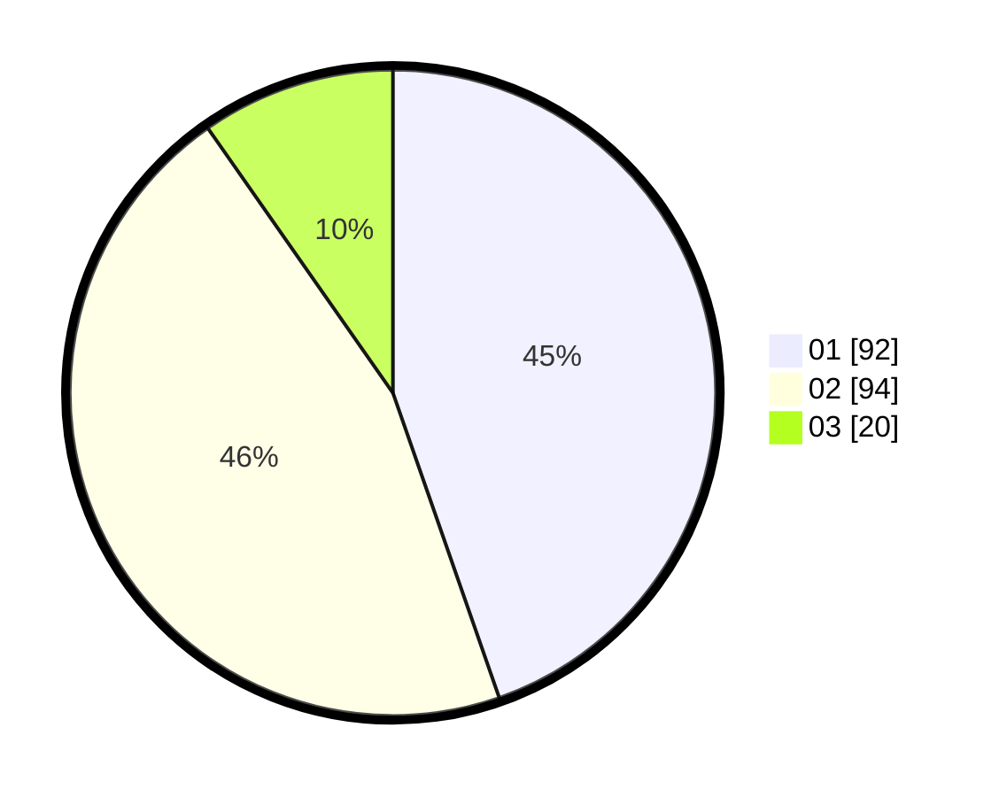

# Hasil

Hasil perolehan suara paslon dapat dilihat pada file paslon-01.txt, paslon-02.txt, dan paslon-03.txt.

Jika tidak ada, artinya data tersebut belum ada pada SIREKAP.

## Perolehan Suara

 * Paslon 01: **92**.
 * Paslon 02: **94**.
 * Paslon 03: **20**.

## Foto C Plano

https://sirekap-obj-formc.kpu.go.id/41d3/pemilu/ppwp/31/75/02/10/04/3175021004054-20240214-235231--f5e8d2c9-1290-4070-a17f-13a2ef58d08e.jpg

https://sirekap-obj-formc.kpu.go.id/41d3/pemilu/ppwp/31/75/02/10/04/3175021004054-20240214-190921--f0b3acbd-5b99-4e22-8efb-151eeb5071d8.jpg

https://sirekap-obj-formc.kpu.go.id/41d3/pemilu/ppwp/31/75/02/10/04/3175021004054-20240214-190928--a42ad282-3f64-4aa1-bc20-d93e4b19510f.jpg

## DATA PEMILIH TETAP

Jumlah pemilih dalam DPT: **285**.
 * L: **151**.
 * P: **134**.

## DATA PENGGUNA HAK PILIH

Jumlah pengguna hak pilih dalam DPT: **203**.
 * L: **101**.
 * P: **102**.

Jumlah pengguna hak pilih dalam DPTb: **2**.
 * L: **1**.
 * P: **1**.

Jumlah pengguna hak pilih dalam DPK: **4**.
 * L: **2**.
 * P: **2**.

Jumlah pengguna hak pilih: **209**.
 * L: **104**.
 * P: **105**.

## JUMLAH SUARA SAH DAN TIDAK SAH

JUMLAH SELURUH SUARA SAH: **206**.

JUMLAH SUARA TIDAK SAH: **3**.

JUMLAH SELURUH SUARA SAH DAN SUARA TIDAK SAH: **209**.
