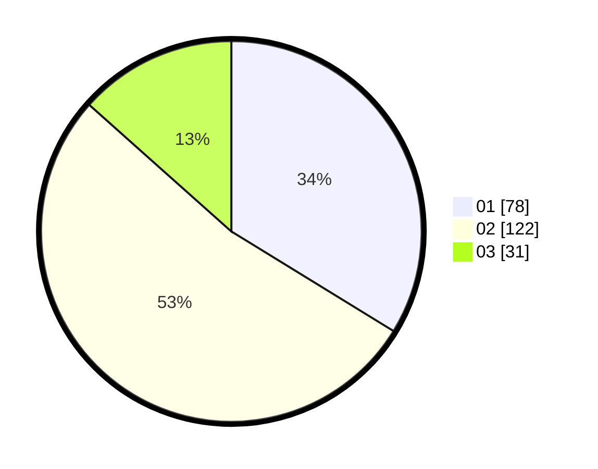

# Hasil

Hasil perolehan suara paslon dapat dilihat pada file paslon-01.txt, paslon-02.txt, dan paslon-03.txt.

Jika tidak ada, artinya data tersebut belum ada pada SIREKAP.

## Perolehan Suara

 * Paslon 01: **78**.
 * Paslon 02: **122**.
 * Paslon 03: **31**.

## Foto C Plano

https://sirekap-obj-formc.kpu.go.id/b6f1/pemilu/ppwp/31/75/02/10/04/3175021004062-20240215-204826--a246e78f-e3eb-47f1-bf1b-6b83c97f0921.jpg

https://sirekap-obj-formc.kpu.go.id/b6f1/pemilu/ppwp/31/75/02/10/04/3175021004062-20240215-204828--c4cfcded-b1e7-45cc-b6f9-b8776e913d9a.jpg

https://sirekap-obj-formc.kpu.go.id/b6f1/pemilu/ppwp/31/75/02/10/04/3175021004062-20240215-204826--6fb32300-8e6b-4c46-8b8b-49361b8cfd7a.jpg

## DATA PEMILIH TETAP

Jumlah pemilih dalam DPT: **274**.
 * L: **124**.
 * P: **150**.

## DATA PENGGUNA HAK PILIH

Jumlah pengguna hak pilih dalam DPT: **219**.
 * L: **91**.
 * P: **128**.

Jumlah pengguna hak pilih dalam DPTb: **0**.
 * L: **0**.
 * P: **0**.

Jumlah pengguna hak pilih dalam DPK: **5**.
 * L: **1**.
 * P: **4**.

Jumlah pengguna hak pilih: **224**.
 * L: **92**.
 * P: **132**.

## JUMLAH SUARA SAH DAN TIDAK SAH

JUMLAH SELURUH SUARA SAH: **223**.

JUMLAH SUARA TIDAK SAH: **1**.

JUMLAH SELURUH SUARA SAH DAN SUARA TIDAK SAH: **224**.
