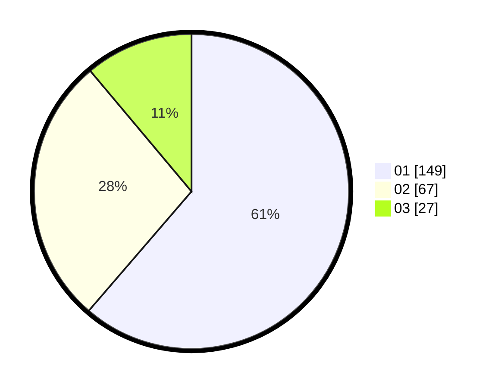

# Hasil

Hasil perolehan suara paslon dapat dilihat pada file paslon-01.txt, paslon-02.txt, dan paslon-03.txt.

Jika tidak ada, artinya data tersebut belum ada pada SIREKAP.

## Perolehan Suara

 * Paslon 01: **149**.
 * Paslon 02: **67**.
 * Paslon 03: **27**.

## Foto C Plano

https://sirekap-obj-formc.kpu.go.id/e90d/pemilu/ppwp/31/75/02/10/04/3175021004066-20240216-135916--42bbbb9c-c82a-470d-ba6e-cd4a4dc15e97.jpg

https://sirekap-obj-formc.kpu.go.id/e90d/pemilu/ppwp/31/75/02/10/04/3175021004066-20240214-155235--5606f3c9-87e2-4f99-ad6f-7e5f49d33715.jpg

https://sirekap-obj-formc.kpu.go.id/e90d/pemilu/ppwp/31/75/02/10/04/3175021004066-20240216-135917--83c78087-0dd7-4f23-afae-aec40d47b993.jpg

## DATA PEMILIH TETAP

Jumlah pemilih dalam DPT: **287**.
 * L: **138**.
 * P: **149**.

## DATA PENGGUNA HAK PILIH

Jumlah pengguna hak pilih dalam DPT: **241**.
 * L: **117**.
 * P: **124**.

Jumlah pengguna hak pilih dalam DPTb: **0**.
 * L: **0**.
 * P: **0**.

Jumlah pengguna hak pilih dalam DPK: **2**.
 * L: **1**.
 * P: **1**.

Jumlah pengguna hak pilih: **243**.
 * L: **118**.
 * P: **125**.

## JUMLAH SUARA SAH DAN TIDAK SAH

JUMLAH SELURUH SUARA SAH: **243**.

JUMLAH SUARA TIDAK SAH: **0**.

JUMLAH SELURUH SUARA SAH DAN SUARA TIDAK SAH: **243**.
