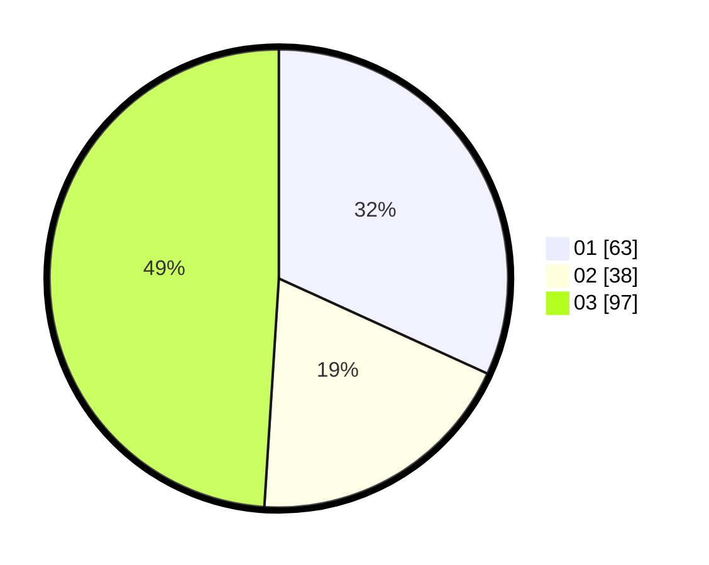

# Hasil

Hasil perolehan suara paslon dapat dilihat pada file paslon-01.txt, paslon-02.txt, dan paslon-03.txt.

Jika tidak ada, artinya data tersebut belum ada pada SIREKAP.

## Perolehan Suara

 * Paslon 01: **63**.
 * Paslon 02: **38**.
 * Paslon 03: **97**.

## Foto C Plano

https://sirekap-obj-formc.kpu.go.id/6617/pemilu/ppwp/31/75/02/10/04/3175021004067-20240214-202711--6f3c7894-aac1-44a7-b161-ef79fb350c6f.jpg

https://sirekap-obj-formc.kpu.go.id/6617/pemilu/ppwp/31/75/02/10/04/3175021004067-20240214-190417--79d3fe7d-e826-4e04-8564-18aa4de52fa8.jpg

https://sirekap-obj-formc.kpu.go.id/6617/pemilu/ppwp/31/75/02/10/04/3175021004067-20240214-191655--e931ac97-3532-44a2-b9ff-c239b0f965a2.jpg
