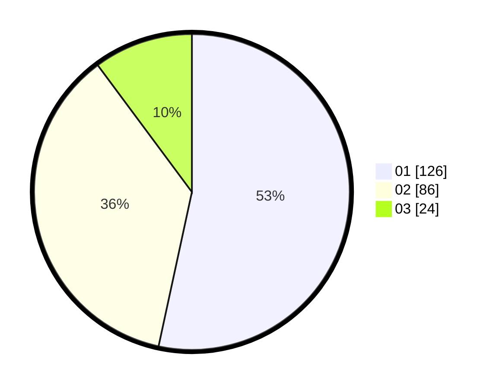

# Hasil

Hasil perolehan suara paslon dapat dilihat pada file paslon-01.txt, paslon-02.txt, dan paslon-03.txt.

Jika tidak ada, artinya data tersebut belum ada pada SIREKAP.

## Perolehan Suara

 * Paslon 01: **126**.
 * Paslon 02: **86**.
 * Paslon 03: **24**.

## Foto C Plano

https://sirekap-obj-formc.kpu.go.id/ab2a/pemilu/ppwp/31/75/02/10/04/3175021004068-20240214-201916--65d89d97-607f-4569-9218-f3ef9cdac42e.jpg

https://sirekap-obj-formc.kpu.go.id/ab2a/pemilu/ppwp/31/75/02/10/04/3175021004068-20240214-201903--9caedf9d-3109-475d-b26b-04d13d4c1f34.jpg

https://sirekap-obj-formc.kpu.go.id/ab2a/pemilu/ppwp/31/75/02/10/04/3175021004068-20240216-182547--bec6a881-fa1b-4005-89b9-12c3c1637b5b.jpg

## DATA PEMILIH TETAP

Jumlah pemilih dalam DPT: **284**.
 * L: **146**.
 * P: **138**.

## DATA PENGGUNA HAK PILIH

Jumlah pengguna hak pilih dalam DPT: **232**.
 * L: **110**.
 * P: **122**.

Jumlah pengguna hak pilih dalam DPTb: **0**.
 * L: **0**.
 * P: **0**.

Jumlah pengguna hak pilih dalam DPK: **4**.
 * L: **1**.
 * P: **3**.

Jumlah pengguna hak pilih: **236**.
 * L: **111**.
 * P: **125**.

## JUMLAH SUARA SAH DAN TIDAK SAH

JUMLAH SELURUH SUARA SAH: **236**.

JUMLAH SUARA TIDAK SAH: **0**.

JUMLAH SELURUH SUARA SAH DAN SUARA TIDAK SAH: **236**.
