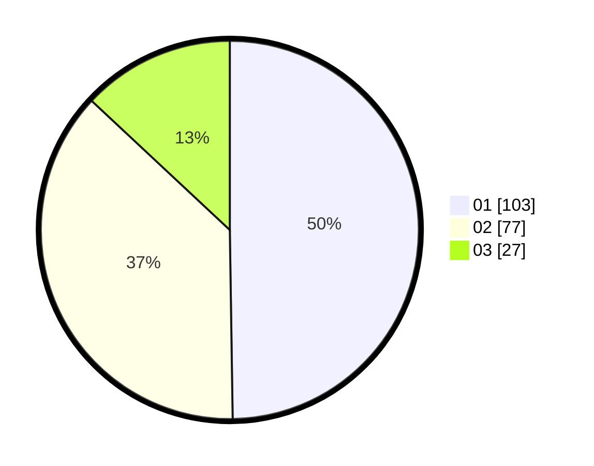

# Hasil

Hasil perolehan suara paslon dapat dilihat pada file paslon-01.txt, paslon-02.txt, dan paslon-03.txt.

Jika tidak ada, artinya data tersebut belum ada pada SIREKAP.

## Perolehan Suara

 * Paslon 01: **103**.
 * Paslon 02: **77**.
 * Paslon 03: **27**.

## Foto C Plano

https://sirekap-obj-formc.kpu.go.id/200d/pemilu/ppwp/31/75/02/10/04/3175021004069-20240215-212352--045f4360-c4a2-4a5c-a1e4-b58a3e2f1ec8.jpg

https://sirekap-obj-formc.kpu.go.id/200d/pemilu/ppwp/31/75/02/10/04/3175021004069-20240215-212355--2c8331b0-79ec-4aec-bbb9-acbd3012b7e4.jpg

https://sirekap-obj-formc.kpu.go.id/200d/pemilu/ppwp/31/75/02/10/04/3175021004069-20240215-212353--c83fd208-19ba-42ac-9133-e85c97c719ac.jpg

## DATA PEMILIH TETAP

Jumlah pemilih dalam DPT: **279**.
 * L: **148**.
 * P: **131**.

## DATA PENGGUNA HAK PILIH

Jumlah pengguna hak pilih dalam DPT: **206**.
 * L: **108**.
 * P: **98**.

Jumlah pengguna hak pilih dalam DPTb: **1**.
 * L: **1**.
 * P: **0**.

Jumlah pengguna hak pilih dalam DPK: **2**.
 * L: **1**.
 * P: **1**.

Jumlah pengguna hak pilih: **209**.
 * L: **110**.
 * P: **99**.

## JUMLAH SUARA SAH DAN TIDAK SAH

JUMLAH SELURUH SUARA SAH: **207**.

JUMLAH SUARA TIDAK SAH: **2**.

JUMLAH SELURUH SUARA SAH DAN SUARA TIDAK SAH: **209**.
