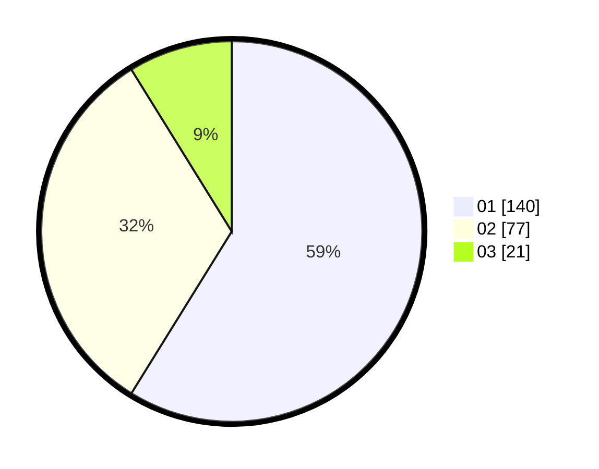

# Hasil

Hasil perolehan suara paslon dapat dilihat pada file paslon-01.txt, paslon-02.txt, dan paslon-03.txt.

Jika tidak ada, artinya data tersebut belum ada pada SIREKAP.

## Perolehan Suara

 * Paslon 01: **140**.
 * Paslon 02: **77**.
 * Paslon 03: **21**.

## Foto C Plano

https://sirekap-obj-formc.kpu.go.id/8d13/pemilu/ppwp/31/75/02/10/04/3175021004071-20240216-135422--f635874c-d254-4023-928f-646ae0ccc32b.jpg

https://sirekap-obj-formc.kpu.go.id/8d13/pemilu/ppwp/31/75/02/10/04/3175021004071-20240216-135423--1b43a4d8-e71c-4448-be6c-a46e49bdf2f1.jpg

https://sirekap-obj-formc.kpu.go.id/8d13/pemilu/ppwp/31/75/02/10/04/3175021004071-20240216-135423--1b68463d-bc4c-4832-b56b-9ead8a5eef32.jpg

## DATA PEMILIH TETAP

Jumlah pemilih dalam DPT: **291**.
 * L: **134**.
 * P: **157**.

## DATA PENGGUNA HAK PILIH

Jumlah pengguna hak pilih dalam DPT: **234**.
 * L: **98**.
 * P: **136**.

Jumlah pengguna hak pilih dalam DPTb: **1**.
 * L: **0**.
 * P: **1**.

Jumlah pengguna hak pilih dalam DPK: **4**.
 * L: **2**.
 * P: **2**.

Jumlah pengguna hak pilih: **239**.
 * L: **100**.
 * P: **139**.

## JUMLAH SUARA SAH DAN TIDAK SAH

JUMLAH SELURUH SUARA SAH: **238**.

JUMLAH SUARA TIDAK SAH: **1**.

JUMLAH SELURUH SUARA SAH DAN SUARA TIDAK SAH: **239**.
