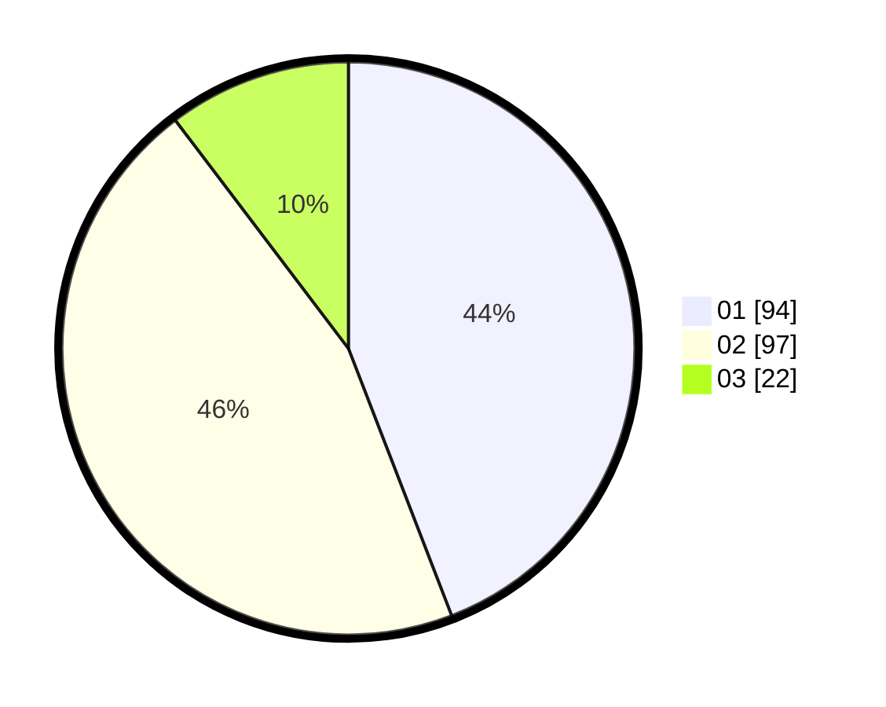

# Hasil

Hasil perolehan suara paslon dapat dilihat pada file paslon-01.txt, paslon-02.txt, dan paslon-03.txt.

Jika tidak ada, artinya data tersebut belum ada pada SIREKAP.

## Perolehan Suara

 * Paslon 01: **94**.
 * Paslon 02: **97**.
 * Paslon 03: **22**.

## Foto C Plano

https://sirekap-obj-formc.kpu.go.id/5118/pemilu/ppwp/31/75/02/10/04/3175021004073-20240214-155849--8b4ce0ca-3c5d-4c53-9230-84dc41b398f1.jpg

https://sirekap-obj-formc.kpu.go.id/5118/pemilu/ppwp/31/75/02/10/04/3175021004073-20240216-132222--f37afe21-733a-46ae-9a67-b4c2fa7039df.jpg

https://sirekap-obj-formc.kpu.go.id/5118/pemilu/ppwp/31/75/02/10/04/3175021004073-20240214-155714--4fe2307a-7faf-4d7d-b7f8-7d8a1f0175c6.jpg

## DATA PEMILIH TETAP

Jumlah pemilih dalam DPT: **288**.
 * L: **146**.
 * P: **142**.

## DATA PENGGUNA HAK PILIH

Jumlah pengguna hak pilih dalam DPT: **213**.
 * L: **106**.
 * P: **107**.

Jumlah pengguna hak pilih dalam DPTb: **0**.
 * L: **0**.
 * P: **0**.

Jumlah pengguna hak pilih dalam DPK: **4**.
 * L: **3**.
 * P: **1**.

Jumlah pengguna hak pilih: **217**.
 * L: **109**.
 * P: **108**.

## JUMLAH SUARA SAH DAN TIDAK SAH

JUMLAH SELURUH SUARA SAH: **213**.

JUMLAH SUARA TIDAK SAH: **4**.

JUMLAH SELURUH SUARA SAH DAN SUARA TIDAK SAH: **217**.
