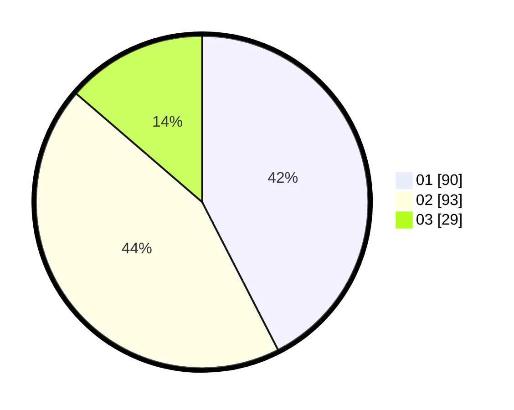

# Hasil

Hasil perolehan suara paslon dapat dilihat pada file paslon-01.txt, paslon-02.txt, dan paslon-03.txt.

Jika tidak ada, artinya data tersebut belum ada pada SIREKAP.

## Perolehan Suara

 * Paslon 01: **90**.
 * Paslon 02: **93**.
 * Paslon 03: **29**.

## Foto C Plano

https://sirekap-obj-formc.kpu.go.id/ec9b/pemilu/ppwp/31/75/02/10/04/3175021004075-20240214-184402--6a4b70a1-90be-4c0a-a835-f18076ee73a6.jpg

https://sirekap-obj-formc.kpu.go.id/ec9b/pemilu/ppwp/31/75/02/10/04/3175021004075-20240214-184537--f552efab-ec46-40a9-b9d4-3398a38887cf.jpg

https://sirekap-obj-formc.kpu.go.id/ec9b/pemilu/ppwp/31/75/02/10/04/3175021004075-20240214-184620--41ee4ab1-c4b1-479e-9ecd-ada18ae17aec.jpg

## DATA PEMILIH TETAP

Jumlah pemilih dalam DPT: **293**.
 * L: **154**.
 * P: **139**.

## DATA PENGGUNA HAK PILIH

Jumlah pengguna hak pilih dalam DPT: **212**.
 * L: **106**.
 * P: **106**.

Jumlah pengguna hak pilih dalam DPTb: **0**.
 * L: **0**.
 * P: **0**.

Jumlah pengguna hak pilih dalam DPK: **3**.
 * L: **2**.
 * P: **1**.

Jumlah pengguna hak pilih: **215**.
 * L: **108**.
 * P: **107**.

## JUMLAH SUARA SAH DAN TIDAK SAH

JUMLAH SELURUH SUARA SAH: **212**.

JUMLAH SUARA TIDAK SAH: **4**.

JUMLAH SELURUH SUARA SAH DAN SUARA TIDAK SAH: **215**.
