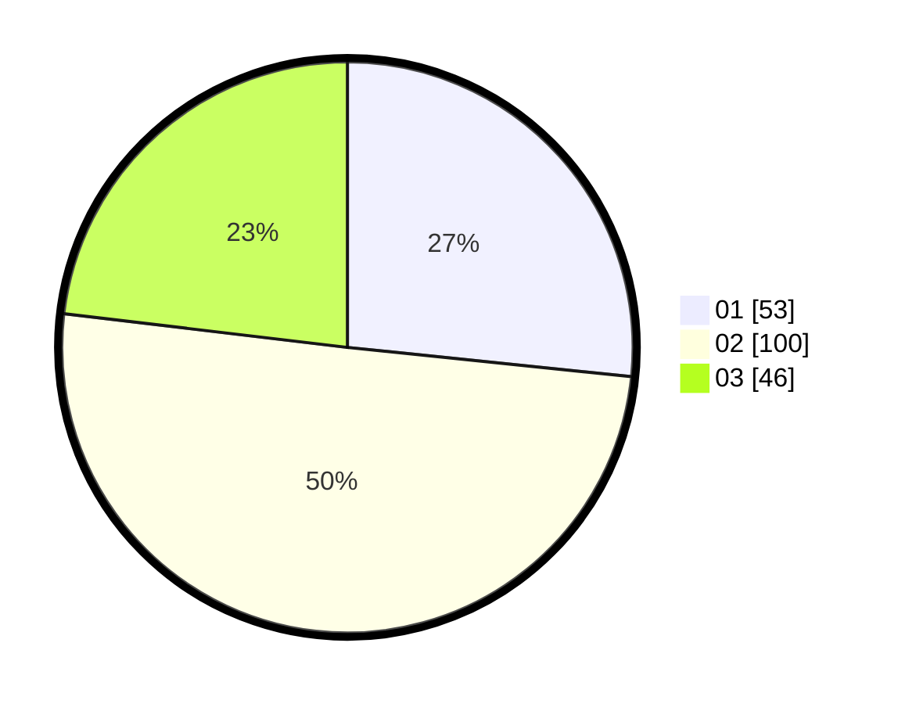

# Hasil

Hasil perolehan suara paslon dapat dilihat pada file paslon-01.txt, paslon-02.txt, dan paslon-03.txt.

Jika tidak ada, artinya data tersebut belum ada pada SIREKAP.

## Perolehan Suara

 * Paslon 01: **53**.
 * Paslon 02: **100**.
 * Paslon 03: **46**.

## Foto C Plano

https://sirekap-obj-formc.kpu.go.id/7504/pemilu/ppwp/31/75/02/10/04/3175021004076-20240215-215515--6191208f-c28a-413c-b72b-821e0970248e.jpg

https://sirekap-obj-formc.kpu.go.id/7504/pemilu/ppwp/31/75/02/10/04/3175021004076-20240214-191537--b4404ded-492f-4061-bd4c-5a76e5428083.jpg

https://sirekap-obj-formc.kpu.go.id/7504/pemilu/ppwp/31/75/02/10/04/3175021004076-20240215-215516--88f34abb-edc5-48a7-aada-8f714d25f1e0.jpg

## DATA PEMILIH TETAP

Jumlah pemilih dalam DPT: **294**.
 * L: **148**.
 * P: **146**.

## DATA PENGGUNA HAK PILIH

Jumlah pengguna hak pilih dalam DPT: **201**.
 * L: **96**.
 * P: **105**.

Jumlah pengguna hak pilih dalam DPTb: **1**.
 * L: **1**.
 * P: **0**.

Jumlah pengguna hak pilih dalam DPK: **0**.
 * L: **0**.
 * P: **0**.

Jumlah pengguna hak pilih: **202**.
 * L: **97**.
 * P: **105**.

## JUMLAH SUARA SAH DAN TIDAK SAH

JUMLAH SELURUH SUARA SAH: **199**.

JUMLAH SUARA TIDAK SAH: **3**.

JUMLAH SELURUH SUARA SAH DAN SUARA TIDAK SAH: **202**.
