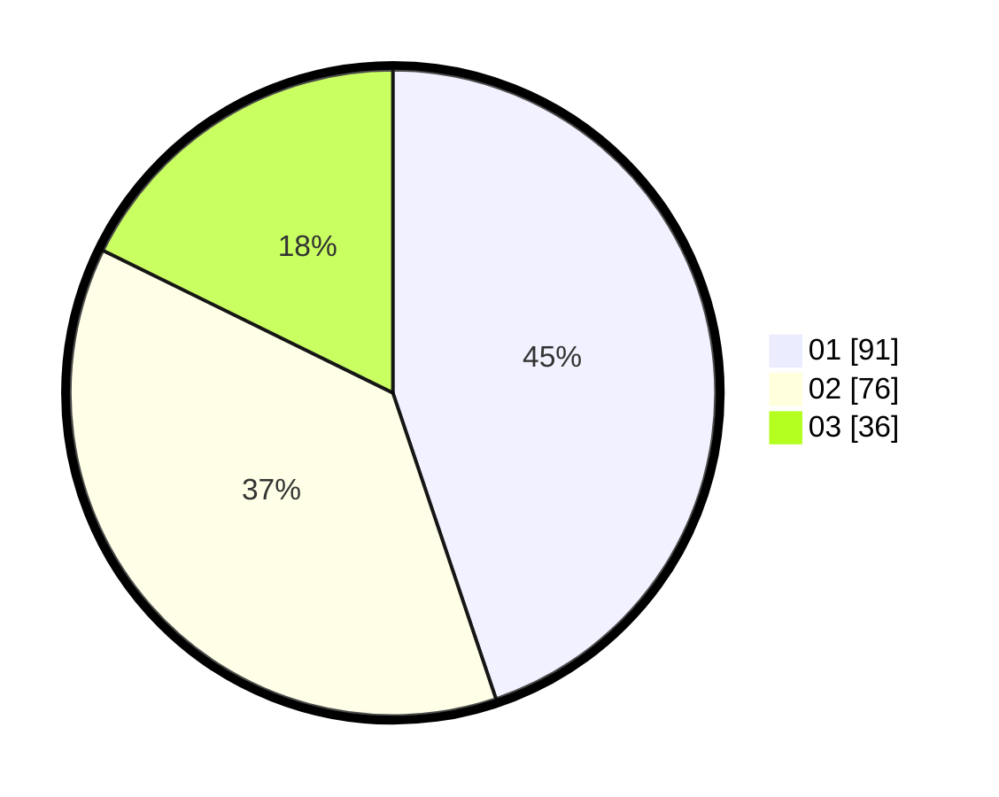

# Hasil

Hasil perolehan suara paslon dapat dilihat pada file paslon-01.txt, paslon-02.txt, dan paslon-03.txt.

Jika tidak ada, artinya data tersebut belum ada pada SIREKAP.

## Perolehan Suara

 * Paslon 01: **91**.
 * Paslon 02: **76**.
 * Paslon 03: **36**.

## Foto C Plano

https://sirekap-obj-formc.kpu.go.id/0665/pemilu/ppwp/31/75/02/10/04/3175021004077-20240216-074238--0eb65898-d9bc-428b-9263-1b6d93b514aa.jpg

https://sirekap-obj-formc.kpu.go.id/0665/pemilu/ppwp/31/75/02/10/04/3175021004077-20240216-074240--c450bcad-3a29-479b-a6d9-46077f20c4f8.jpg

https://sirekap-obj-formc.kpu.go.id/0665/pemilu/ppwp/31/75/02/10/04/3175021004077-20240216-074239--b58a4299-4b36-4e7a-a91c-c227dd600f0f.jpg

## DATA PEMILIH TETAP

Jumlah pemilih dalam DPT: **289**.
 * L: **145**.
 * P: **144**.

## DATA PENGGUNA HAK PILIH

Jumlah pengguna hak pilih dalam DPT: **201**.
 * L: **96**.
 * P: **105**.

Jumlah pengguna hak pilih dalam DPTb: **0**.
 * L: **0**.
 * P: **0**.

Jumlah pengguna hak pilih dalam DPK: **7**.
 * L: **4**.
 * P: **3**.

Jumlah pengguna hak pilih: **208**.
 * L: **100**.
 * P: **108**.

## JUMLAH SUARA SAH DAN TIDAK SAH

JUMLAH SELURUH SUARA SAH: **203**.

JUMLAH SUARA TIDAK SAH: **5**.

JUMLAH SELURUH SUARA SAH DAN SUARA TIDAK SAH: **208**.
